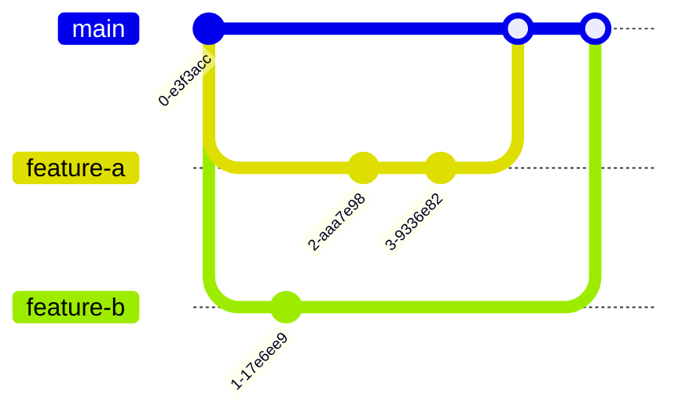

# GitLab over GitHub

Over the years, many people have asked me why I prefer using GitLab over GitHub.
Although an exhaustive comparison wouldn't be possible in a single article, I'd like to highlight a few points of interest.

<!-- more -->

## What's the difference between Git and GitHub?

[Git](https://en.wikipedia.org/wiki/Git) is a distributed version control system. Git was created by [Linus Torvalds](https://en.wikipedia.org/wiki/Linus_Torvalds), the creator of the Linux kernel. Git was born for [massive projects](https://devblogs.microsoft.com/bharry/the-largest-git-repo-on-the-planet/) with [thousands of contributors](https://lwn.net/Articles/915435/). Since its release, it has become, by far, the most used version control system in software development.

Git is software you can download. Most people use it through the CLI or through their IDE, but it also offers [its own webserver you can host to share you projects](https://git-scm.com/book/en/v2/Git-on-the-Server-GitWeb).

Git is *distributed*: anyone contributing to a Git repository gets a complete local copy of the entire project, with all its history. Any project member can work entirely independently, even offline. Each contributor can later expose their version to everyone else, allowing them to copy everything into their own version.

However, most projects still follow a centralized development workflow: there is an "official" version, and everything else are personal copies (called "forks"). In the early days, people would set up their own webserver. Much like with anything else requiring self-hosting, like blogs or video, services quickly appeared to do this for you. They're collectively called Git hosting services, and [GitHub](https://github.com/) is, by far, the better known.

One of its competitors, [GitLab](https://about.gitlab.com/), slowly grew in popularity. It got in the public attention in 2018, when Microsoft acquired GitHub, and a large number of projects migrated to GitLab overnight, including [GNOME](https://gitlab.gnome.org/GNOME), [GIMP](https://gitlab.gnome.org/GNOME/gimp), and [F-Droid](https://gitlab.com/fdroid). Many other major open source projects are hosted on GitLab: [Inkscape](https://gitlab.com/inkscape/inkscape), [KDE](https://invent.kde.org/), [ArchLinux](https://gitlab.archlinux.org/archlinux), [Wireshark](https://gitlab.com/wireshark/wireshark)…

I started using GitLab around 2017, and I don't think GitHub has caught up to what it could do then, never mind what it can now.

## The most basic features I expect

Before I start going into the nice features you didn't know were possible, let's review the most basic features of a Git hosting service.

- Host a repository, make it public, share it with other people.
- Have a branch-based way of reviewing and integrating code.
- Have a way to publish artifacts / static websites.
- Have basic project management features (issue tracking…).
- View the project history as a graph.

And, already, we've hit a bump. No, GitHub doesn't let you see the project graph on the free tier. This is essentially the first command anyone learns (at least when they learn to make an alias) but it's not available in the most popular Git hosting platforms.

While you can publish Maven or NPM artifacts to GitHub, [users must log in](https://docs.github.com/en/packages/working-with-a-github-packages-registry/working-with-the-apache-maven-registry) to be able to pull from it, which makes it a no-go for any wide open source usage.

Let's review a few other nice features GitHub doesn't have in the free tier:

- Protected branches, to stop people from force-pushing to the main branch.
- Draft pull requests.
- Exporting your issues to your calendar.
- Printing a magic link to view the pull request when you push to a branch (well, it does display it the very first time you push, but never again).

Honestly, the only feature I've noticed that GitLab lacks is support for the non-standard `Co-Authored-By` header, which I find quite convenient.
Oh, and discussions, those are great.

Another GitLab feature that changes the whole experience are [quick actions](https://docs.gitlab.com/ee/user/project/quick_actions.html). As a developer, I type a lot faster than I can interact with a web form. With GitLab, all UI actions have a related textual command. For example, when I review a merge request, I can quickly write a comment:
```text
Hey! This looks pretty good to me, thanks!

/assign_reviewer me
/approve
/merge
```
Of course, there is full completion support.

GitHub is already behind on the most basic features. We're far from done, however.

## Being a herald of Open Source

As the go-to platform for hosting Open Source software, GitHub has a very prominent reach over the ecosystem. Microsoft [hasn't always been known to love open source](https://en.wikipedia.org/wiki/Embrace,_extend,_and_extinguish), and GitHub often has ambiguous actions. GitHub releases [Git changelogs as if it were its own](https://github.blog/open-source/git/), has bought [massively important parts of the ecosystem](https://github.blog/news-insights/company-news/npm-is-joining-github/), offers [sponsorships with a 6% fee](https://docs.github.com/en/sponsors/getting-started-with-github-sponsors/about-github-sponsors), offers [its own CLI that hides Git](https://cli.github.com/). Now, I'm not saying these features are necessarily malicious in intent—but these sure look like an "extend" phase. Even if that's not the case, putting all eggs in one basket is harmful in itself.

GitLab… is different. GitLab believes in transparency. GitLab believes in open source as a business model. Don't believe me? It's [there](https://gitlab.com/gitlab-org/gitlab). The entire code, including the premium plans. GitLab is the only company I know [that uploads its internal meetings to YouTube](https://www.youtube.com/watch?v=lBVtvOpU80Q) (seriously, go read the comments). If that's not enough to convince you that GitLab is an anomaly, they're also fully remote.

If I'm going to choose a single company that will be the herald of everything open source related, I'm going to choose one that actually believes what they're preaching. One that is open source itself. And it's not going to be Microsoft.

When I first started, [GitLab gave away its Ultimate tier for free to any public project with a permissive license](https://about.gitlab.com/blog/2022/02/04/ultimate-perks-for-open-source-projects/). They since stopped, and now require projects to [manually enroll and be non-profit](https://about.gitlab.com/solutions/open-source/), which is the standard for open source plans nowadays.

GitLab is also not just for open source: it allows you to self-host the entire system, for free. This is a great option for companies or organizations that require private code, but can't afford paying a subscription to every contributor. This is how I first got introduced to GitLab: [the university I went to](../../../experience/iut.md) had its own GitLab instance.

## Project management

I won't go into details on project management, because that's not necessarily what I'm the most interested in, but if you're interested, have some fun comparing these.

GitHub:

- [Issues](https://docs.github.com/issues)
- [Labels](https://docs.github.com/issues/using-labels-and-milestones-to-track-work/managing-labels)
- [Discussions](https://docs.github.com/discussions)
- [Projects](https://docs.github.com/issues/planning-and-tracking-with-projects/learning-about-projects/about-projects)
- [Milestones](https://docs.github.com/issues/using-labels-and-milestones-to-track-work/about-milestones)
- [Charts](https://docs.github.com/issues/planning-and-tracking-with-projects/viewing-insights-from-your-project)
- [Wikis](https://docs.github.com/communities/documenting-your-project-with-wikis/about-wikis)

GitLab:

- [Issues](https://docs.gitlab.com/ee/user/project/issues/) and [Tasks](https://docs.gitlab.com/ee/user/tasks.html) (sub-issues); [confidential issues](https://docs.gitlab.com/ee/user/project/issues/confidential_issues.html), [issue dependencies and links](https://docs.gitlab.com/ee/user/project/issues/related_issues.html#blocking-issues)
- [Requirements](https://about.gitlab.com/direction/plan/#requirements-management) ("user stories")
- [Test plans](https://about.gitlab.com/direction/plan/#quality-management)
- [Personal TODO list](https://docs.gitlab.com/ee/user/todos.html)
- [Time tracking](https://about.gitlab.com/solutions/time-tracking/)
- [Labels](https://docs.gitlab.com/ee/user/project/labels.html) (including prioritization and scoping)
- [Threads in all pages](https://docs.gitlab.com/ee/user/discussions/) (only available in Discussions on GitHub)
- [Service desk](https://about.gitlab.com/stages-devops-lifecycle/service-desk/) (public email address that your users can use to create issues and get updates on their progress directly, without ever creating a GitLab account)
- [Iterations](https://docs.gitlab.com/ee/user/group/iterations/#iteration-cadences) ("sprints")
- [Milestones](https://docs.gitlab.com/ee/user/project/milestones/)
- [Epics](https://docs.gitlab.com/ee/user/group/epics/epic_boards.html)
- [Burnup and burndown charts](https://docs.gitlab.com/ee/user/project/milestones/burndown_and_burnup_charts.html#burnup-charts), [Analytics](https://docs.gitlab.com/ee/user/group/issues_analytics), [Roadmaps](https://docs.gitlab.com/ee/user/group/roadmap/), [Value streams](https://about.gitlab.com/direction/plan/value_stream_management/)
- [Integration with Figma](https://docs.gitlab.com/ee/user/project/issues/design_management.html#gitlab-figma-plugin)
- [Wikis](https://docs.gitlab.com/ee/user/project/wiki/)

Sure, GitLab project management is nothing compared to a Jira instance, but most small teams don't have the need for one. And if you have one, [GitLab integrates with it directly](https://about.gitlab.com/solutions/jira/).

Do I use most of these features? No. I mostly do open source work with very small teams. But I do use sub-issues, issue linking, complex labels and the service desk, which are all features GitHub simply doesn't have. 

## Forks and how to break them

Another crucial aspect of open source development is the ability to create forks. Here, there's not much I can say, GitHub and GitLab are fairly similar.

One difference, though, is that GitHub forks tend to overshare: [public forks are public forever and include all prior private code, even if they're later deleted](https://trufflesecurity.com/blog/anyone-can-access-deleted-and-private-repo-data-github), or [running malicious CI using an open source project's quota](https://therecord.media/github-investigating-crypto-mining-campaign-abusing-its-server-infrastructure).

## DevOps

GitLab made CI/CD easy. GitHub attempted to make it reusable, through the concept of Actions that can be versioned and imported between repositories. In theory, they would be great, but in practice it makes CI files long and complex. Of course, GitLab also has many ways to reuse configuration between repositories ([maybe](https://docs.gitlab.com/ee/ci/yaml/includes.html) [too](https://docs.gitlab.com/ee/ci/yaml/yaml_optimization.html) [many](https://docs.gitlab.com/ee/ci/components/), [seriously](https://about.gitlab.com/blog/2024/08/06/introducing-ci-cd-steps-a-programming-language-for-devsecops-automation/)), but let's keep it simple. Let's look at a typical GitHub action and migrate it to GitLab.

Here, we want to execute Gradle tests and display the results in a Pull Request/Merge Request.

```yaml title=".github/workflows/CI.yaml"
name: CI

# Run this workflow every time a new commit pushed to your repository
on: push

jobs:
  build-and-test:
    name: Build and test
    runs-on: ubuntu-latest

    steps:
      - name: Checkout code
        uses: actions/checkout@v2
      - name: Build
        run: ./gradlew build

      - name: Upload Unit Test Results
        if: always()
        uses: actions/upload-artifact@v2
        with:
          name: tests-results # Name artifact for storage in cache
          path: |
            **/build/test-results/**/*.xml

  publish-test-results:
    name: Publish tests results
    runs-on: ubuntu-latest
    needs: build-and-test
    # the build-and-test job might be skipped, we don't need to run this job then
    if: success() || failure()
    permissions:
      checks: write
      pull-requests: write

    steps:
      - name: Download Artifacts
        uses: actions/download-artifact@v2
        with:
          name: tests-results # Name of artifact in cache
          path: tests-results/

      - name: Publish Unit Test Results
        uses: docker://ghcr.io/enricomi/publish-unit-test-result-action:v1
        if: always()
        with:
          github_token: ${{ github.token }}
          files: tests-results/**/*.xml
```

Ouch, writing this took me quite some time, including navigating from the original article to the documentation (or lack thereof) of each workflow. And I had an example to look at.

Let's convert this entire thing to GitLab CI:
```yaml title=".gitlab-ci.yml"
build-and-test:
  image: ubuntu:latest

  script:
    - ./gradlew build

  artifacts:
    reports:
      junit: '**/build/test-results/**/*.xml'
    when: always
```

Yes, this is the same thing. Everything can be learned directly from [a single documentation page](https://docs.gitlab.com/ee/ci/yaml/). Seriously, CI/CD doesn't have to be this difficult. Yes, GitLab natively supports rendering JUnit-like test results in the Merge Request UI, as well as [many other formats](https://docs.gitlab.com/ee/ci/yaml/artifacts_reports.html).

Of course, I don't write this each time I start a new project. It's all declared in a [nice template](https://gitlab.com/opensavvy/ci-templates/-/blob/main/gradle.gitlab-ci.yml), that I can quickly import to create more complex pipelines quicker. It also handles Gradle caching, Docker image creation, getting the version number from Git, etc.

If you run out of CI minutes, GitLab lets you install the runner infrastructure on your own hardware. It's probably called `gitlab-runner` and available directly in your distribution of choice. It's a single line to configure, and after that your CI runs for free, unlimited, on whichever device·s you installed it on.

[OpenSavvy](../../../experience/opensavvy.md) uses its CI more effectively than many enterprise projects I have seen. We have a small server that starts picking up jobs whenever we're out of quota, and we never worry about it at all. 

## Merge trains

Nice, I get an occasion to show off Mermaid's nice Git graphs :)



(okay, I'll admit the color choice isn't great.)

We have two feature branches that were developed entirely in parallel from each other, and merged quickly one after another. You may be surprised, but it's actually possible to break `main` by merging two branches that independently merge into `main` cleanly. This happens if there is an undetected conflict between branch `feature-a` and `feature-b`.

Undetected conflicts are conflicts that happen because the meaning has changed, but the text hasn't (in which case it would be detected by Git and the merge would fail). For example, deleting or renaming a function in a branch, and calling it in another. 

These types of conflicts are frequent in asynchronous contexts where a lot of branches are merged at once. During the development of [Formulaide](../../../experience/arcachon.md#formulaide), we would get one such conflict a month.

A good way to solve these issues is the concept of [merge trains](https://docs.gitlab.com/ee/ci/pipelines/merge_trains.html): when merging a branch, instead of running the CI for the branch, we run it for the result of the merge commit. Only if the CI passes is the commit actually saved in the repository. If multiple MRs are marked for merging at the same time, they are added to a "train": all merge commits are created, each one runs a CI pipeline, and they are pushed to the repository as the pipelines pass. If any MR fails, it leaves the train, and all the subsequent ones restart themselves.

Merge trains are the safest way to merge Git branches. Conflicts cannot happen, even between branches that are not aware of each other. It is guaranteed that the pipeline always passes for the `main` branch (as long as it is deterministic, of course).

Merge trains are natively supported by GitLab (in paid tiers). When enabled, the reviewer simply presses the 'merge' button, and everything slowly merges. These types of features are crucial to enormous projects with a lot of traffic. So, how do GitHub users deal with this?

Let's look at the [Rust foundation's guidelines](https://rustc-dev-guide.rust-lang.org/contributing.html#pull-requests). Ignoring the different custom bots used to assign reviewers, we find [@bors](https://forge.rust-lang.org/infra/docs/bors.html), a bot that reimplements merge trains on top of GitHub. Users always interact with the bot, and using the 'merge' button or any other GitHub feature is forbidden.

## Review apps

Software is rarely developed by software engineers alone. Many other people take part in development, be it for specification, design, documentation, etc. Ever tried to ask your clients to review pull requests? Yeah, it's not going to happen. GitHub is hostile to anyone who isn't a developer.

In so many companies, all features go through two completely different workflows of verification: developers have a closed iterative workflow with pull requests that finishes in a few days at most. Then, features have to wait until they are deployed to a QA system, wait a few more days for the testers to spend a dedicated day going through their todo lists, and after that it goes to the next environment. At best, user feedback happens a few weeks after the feature was initially developed. Of course, after that it needs to be changed, but the original developer has long gone to something else.

[Shifting left](https://www.redhat.com/en/topics/devops/shift-left-vs-shift-right) isn't just about developers. For a truly efficient process, we need to allow every involved party to give feedback as early as possible. The best place to do so is at the review phase.

GitLab's [review apps](https://docs.gitlab.com/ee/ci/review_apps/) are a way to deploy an application in a temporary environment during review. Once review is over (merged or cancelled), the temporary environment is torn down. Review apps are really just a nice widget in the merge request UI, your CI deploys your app however it wants.

Review apps change your life. With them, you don't have to check out MRs to review them anywhere. Read the code in the web UI, click on the link to see it already running. It may sound dumb to say, but once you've got accustomed to it, it becomes inconceivable that anyone would test a feature without actually having the app in front of them.

As a byproduct, review apps make your entire DevOps process more efficient: because the app must be deployable entirely automatically, it forces the team to stop spending time doing it manually each time. Any other deployment becomes a single click of a button. Also, since each merge request is in a pristine environment, test results won't be impacted by previous user actions, and the reported data won't be polluted by subsequent user actions.

[Click here](https://gitlab.com/opensavvy/groundwork/prepared/-/merge_requests/94) to see one of them live: there are two "view app" buttons, one for the documentation website, and one for the API documentation. These allow reviewers to look at the final product before making a decision.

## Other things I've tried

These were the main reasons I (and my projects) use GitLab. In this article, I was comparing them to what GitHub offers. There are a few other tools I've used, though.

### Phabricator & Arcanist

The first is [Phabricator](https://www.phacility.com/phabricator/), which was used by the [WildFyre project](../../../experience/wildfyre.md). Phabricator is an all-included development platform, with secrets management, contracts management, etc. Honestly, Phabricator is great, but there's one thing I really don't like: Arcanist. Arcanist is Phabricator's custom Git overlay CLI.

Arcanist wants to encourage "pre-commit review": reviewing code even before it is committed. Well, of course, that can't really happen, people still need to commit. But Arcanist doesn't let you push branches. Instead, it bundles everything from the branch into a diff, uploads that to Phabricator with some added metadata. If the diff is merged, Arcanist regenerates new commits from the previous metadata.

This has a few consequences. First, you can't check out other people's branches, you have to download them through Arcanist. You can't diff branches, since they don't really exist. You can't use GPG signing.

In my opinion, this seems like a major misunderstanding of Git. The main feature of Git is branches, and Arcanist tries its hardest not to use branches at all. Everything Arcanist claims to enable ("don't get too attached to your commits, since they don't really exist") are workflows anyone who knows `rebase` does daily with regular Git, no need to sacrifice half of Git's features to reimplement them in another tool.

I really think it's a shame, I really wanted to like Phabricator. Everything else about it *just makes sense*. In particular, issue tracking and code review simply have the best UI of any tool I've used. They're absolutely feature-packed, while still being extremely easy to read.

### JetBrains Space

[JetBrains Space](https://www.jetbrains.com/space/) [*was*](https://blog.jetbrains.com/space/2024/05/27/the-future-of-space) quite similar to Phabricator in intent: have a single platform for the entire company. Of course, being a JetBrains product, it was centered on code review, but it also contained a general purpose Slack-like messaging system, a way to track paid leaves, to know in which room of which office a colleague was situated.

The only experience I had with Space was very early in the beta. At that time, automation (which was hyped to be the most important part of Space) was not available yet. Everything else was fairly good, but being a beta, it lacked many things.

I was never really the intended audience, though. Space was meant for small-to-medium companies that wanted to have a single platform to handle all their day-to-day things. I was searching for a platform to host open source projects, and Space didn't have ways to fork projects, and pricing plans were all per-seat.

## Conclusion

Well, really, I have two problems with GitHub. The first is that it really wants to be the place where open source happens, all of it, and only there. But it doesn't believe in open source. It won't be open source. And it will train its AI models on your code, ignoring all licensing terms, so it can sell it to you later. I don't appreciate that so many tools now consider "being on GitHub" synonymous to "being open source", to the point that your projects just won't show up in some tools if you don't. We shouldn't willingly give one more monopoly to Microsoft.

The second is that it is just so behind the competition. Clearly, the company direction isn't, and hasn't been for many years, to improve the normal development experience. Their business model isn't to be great at being a Git hosting service, and they won't try to improve on that front. GitHub's model is to provide utilities that only work with itself, and now to sell AIs that abstract away from code itself.

So, for the foreseeable future, I'll be on GitLab.
