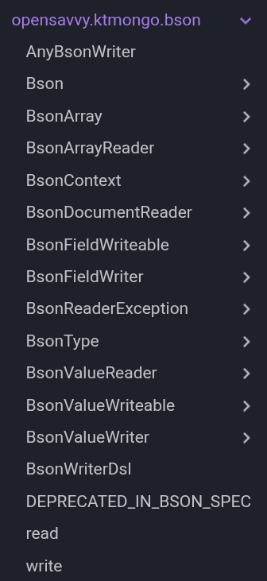
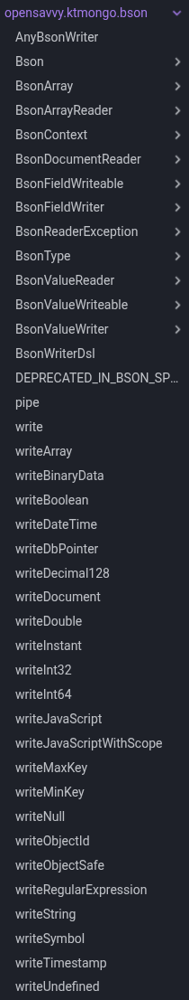

---
date:
  created: 2025-10-13
slug: kotlin-context-parameters
tags:
  - Kotlin
---

# I tried context parameters, Kotlin's new multi-receiver extension functions

Kotlin is getting a new concept that will widen the possibility of extension functions. The feature is still experimental in the latest Kotlin version, which makes it the perfect time to try them out.

<!-- more -->

## Why are context parameters interesting?

### It starts with extension functions

Kotlin has long had extension functions. Extension functions are a way to extend the abilities of a type you don't control.

For example, we can create an extension of the type `String`:
```kotlin
fun String.shuffled(): String =
	this.toList().shuffled().joinToString("")

println("This text is shuffled!".shuffled())
```

While this may look like JavaScript's `.prototype` overriding, there is a major difference: extensions do not modify the extended type, they are purely a syntactical addition. The function `String.shuffled()` declared above is scoped to the current file with the same visibility rules as any other function. 

Two packages could declare the same extension of the same name with different behavior, and there would not be any ambiguity: extension functions have to be imported, just like any other function, and they cannot impact each other. They also cannot override existing functions.

Extension functions are convenient for application developers because they allow adding custom functionality to well-known types that would be too specific to add to the standard library.

Extension functions are convenient for library developers because they allow clear separation of the “core API” and the “convenience API”. For example, the [`String` class in the standard library](https://github.com/JetBrains/kotlin/blob/master/libraries/stdlib/src/kotlin/String.kt#L13) is only a few lines, even though it is one of the richest string implementation of any language: everything else lives in different files, grouped by features, instead of having to manage a single gigantic class that does everything.

### Extension functions are more specific

Extension functions can also be declared for specific types that couldn't be targeted through regular method inheritance. For example, what if we wanted to implement a function only available on lists of vehicles, that returned their average speed?
```kotlin
interface Vehicle {
	val speed: Double
}
```
We could create our own type of list that extends `List`, but that would have large impacts elsewhere as we would need to stick to that specific implementation throughout the codebase.

Instead, in Kotlin, we can declare a regular function that is only available on a list of vehicles specifically:
```kotlin
fun List<Vehicle>.averageSpeed(): Double =
	this.map { it.speed }.average()
```

This ability is hard to obtain in object-oriented languages, but is common place in functional-style languages (for example, Rust's traits).

### Extension functions can be called implicitly

In these examples, I explicitly wrote the `#!kotlin this`, which refers to the _receiver_ of the extension.

:   The receiver of an extension function is the type on which the extension function is declared. In the example above, it is `#!kotlin List<Vehicle>`.
:   Within an extension function, it is available as the special `#!kotlin this` keyword.

Just like anywhere else, `#!kotlin this` is optional when it is unambiguous, so we could write:
```kotlin
fun List<Vehicle>.averageSpeed(): Double =
	map { it.speed }.average()
```

The true power of extension functions, however, comes from their sibling: extension lambdas.

```kotlin
val repeat: MutableList<Int>.() -> Unit = {
	for (i in indices) {
		add(get(i))
	}
}

mutableListOf(1, 2, 3).repeat()
```

The type of extension lambdas is written as a regular lambda typed prefixed by the type of the receiver. Here, in `MutableList<Int>.() -> Unit`, we have a lambda `() -> Unit` (no parameters and no return value) with a receiver of `MutableList<Int>`.

Within the lambda, we _know_ that we implicitly have access to an instance of `MutableList<Int>`. We access `indices`, `add` and `get`, which are all functions from the receiver.

This brings interesting patterns. For example, we could declare a function that can only be called in the lambda passed to a function:

```kotlin
interface DeclarationScope {
	fun declare(name: String)
}

fun declaration(block: DeclarationScope.() -> Unit) {
	val declarations = ArrayList<String>()

	val impl = object : DeclarationScope {
		override fun declare(name: String) {
			declarations += name
		}
	}

	impl.block()

	println("Declarations: $declarations")
}
```

Because `declare()` is a function of `DeclarationScope`, it can only be called when we have an instance of the interface. Since the instance is declared within the function, we cannot get one other than by calling the function.
```kotlin
declaration {
	declare("Foo")
	declare("Bar")
}

declare("Baz")  // ⚠ Does not compile! No DeclarationScope in scope.
```

Library authors regularly use this feature to restrict functions to a given context.

??? tip "Pedantry corner"
    I say that the instance is not available outside the lambda, but that isn't really true. Kotlin doesn't have any features similar to Rust's lifetimes.

    For example, a user could write:
    ```kotlin
    lateinit var d: DeclarationScope

    declaration {
        d = this
    }

    d.declare("Foo")
    ```

    While this is legal from a language design standpoint, it is widely understood to be a misuse of an API and isn't supported.

    In this example, this actually does nothing because the `declarations` list is only available within the bootstrap function. We are adding a new element to the list after the function is finished, but the list will never be read again, so adding a new element has no impact. In different situations, this could break libraries, as few authors prepare for such a weird usage.

    In [KtMongo](https://ktmongo.opensavvy.dev/), such misuse could corrupt the generated requests or cause a request to be different when viewed in the debugger and when executed. To avoid these problems, the KtMongo DSL keeps track of which objects are “frozen“, after which they [cannot be modified anymore](https://gitlab.com/opensavvy/ktmongo/-/blob/main/dsl/src/commonMain/kotlin/tree/CompoundBsonNode.kt?ref_type=heads#L82).

### The limitations of extension functions

While extension functions and lambdas are powerful, they are also limited. For example, a member with the same name on the receiver always has priority, to ensure extensions can't change existing behavior.

```kotlin
class Foo {
	fun display() {
		println("Member")
	}
}

fun Foo.display() {
	println("Extension")
}

Foo().display()  // 'Member'
```

Extensions can only have a single receiver. However, as we've seen, they are a great way to control the visibility of members when creating DSLs. By using extensions for visibility control, we lose the power to use them for their primary purpose of extending an existing type.

As an example, [KtMongo](https://ktmongo.opensavvy.dev/) uses the `div` operator (`/`) to represent MongoDB paths:
```kotlin
User::profile / Profile::name eq "Foo"
```
`User::profile` is a property reference, a special syntax offered by the Kotlin compiler, which outputs a `KProperty1`. Since it is a type from the standard library, we know that `/` and `eq` must be extension functions. However, KtMongo isn't the only library to use these operators on property references. We want to avoid scope pollution, but more importantly, we want to avoid a situation where the user calls operators from the wrong library. To do so, we want to scope these operators to our library's DSL. We would normally do so by making them extensions of our DSL, but this isn't possible here, as they are already extensions on `KProperty1`!

But KtMongo does in fact provide this syntax, thanks to a workaround: we _can_ have multi-receiver functions in Kotlin, with one big limitation: only one can be an extension receiver. The others must be regular member receivers, and they must be the ones to be implicit on the call-site:
```kotlin
class Foo

class Bar {
	fun Foo.display() {
		println("${this@Foo} ${this@Bar}")
	}
}
```

Here, `display` has two receivers: `Foo` (because it is an extension), but also `Bar` (because it is a member). We can call this function in different ways:
```kotlin
with(Foo()) {  // The order of the two 'with' is not important
	with(Bar()) {
		display()
	}
}

with(Bar()) {
	Foo().display()
}
```

However, this call-site doesn't compile:
```kotlin
with(Foo()) {
	Bar().display()  // ⚠
}
```

This is because the extension was specifically declared as `Foo.display()`, so only `Foo` can be specified explicitly in receiver position.

In practice, this means this trick only works if we control the receiver that shouldn't be written. This is how KtMongo implement its operators, which has the downside that it isn't (currently) possible for users to create their own operators with the same call-site, as users must declare operators as extensions on the DSL itself:
```kotlin
// User-supplied operator
fun FindQuery<User>.eq(path: KProperty1<User, String>, value: String) { … }

users.find {
	// KtMongo-supplied operator
	User::name eq "Bob"
	
	// User-supplied operator
	eq(User::name, "Bob")
}
```

All of this can be improved, however.

## What are context parameters?

Context parameters are an upcoming feature of the Kotlin language, described in [KEEP-367](https://github.com/Kotlin/KEEP/blob/context-parameters/proposals/context-parameters.md). Before being known as context parameters, they were known as multi-extension functions, then context receivers. At the time of writing, it seems highly likely that context parameters will be the iteration that reaches stabilization.

Context parameters are available behind `-Xcontext-parameters` since 2.2.0.

### Context parameters look like implicit parameters

Context parameters are a new kind of parameters, which are only specified implicitly:
```kotlin
context(logger: Logger)
fun foo() {
	logger.info { "Welcome!" }
	// …
}
```

Within the function, they are used just like regular parameters. However, on the call-site, an instance must be available within the scope of the call:
```kotlin
with(Logger()) {
	foo()
}
```

Functions can have multiple context parameters. While nesting `with()` calls does work, a new standard library function `context()` allows introducing multiple contexts at once:
```kotlin
context(ContextA(), ContextB(), ContextC()) {
	foo()
}
```

### When should I use extension functions or context parameters?

Selecting one of the other signifies a different meaning to users:

- The receiver _does the action of the function_.
- Regular parameters are the _inputs that determine what the function does_.
- Context parameters determine _how the function interacts with the rest of the system_.

For example, we may have an interface that can display users as well as a logger:
```kotlin
interface Displayer {
	fun display(user: User, logger: Logger)
}

interface Logger {
	fun info(message: String)
}
```

For readability, it can be simpler to consider that the user is displaying itself into the displayer.
However, the following signature would be strange, as the displayer isn't really configuration for what the functin should do, but how it should do it.
```kotlin
// Avoid this signature because it conveys the role 
// of 'displayer' incorrectly.
fun User.display(displayer: Displayer, logger: Logger) =
	displayer.display(this, logger)
```

Typically, we lift this inconsistency by renaming the function to make it explicit that the displayer is a tool rather than an input:
```kotlin
// Avoid this signature because it emphasizes the logger, 
// which is not important to the behavior of the code.
fun User.displayTo(displayer: Displayer, logger: Logger) =
	displayer.display(this, logger)
```

Still, the logger isn't at all an input to the function, it's only here because the displayer needs it. Context parameters allow us to make this role clear:
```kotlin
// Good when we want readers to pay attention to 
// which displayer is used.
context(logger: Logger)
fun User.displayTo(displayer: Displayer) =
	displayer.display(this, logger)
```

We can also decide to consider the displayer as a service used as an implementation detail, so we could make it a context parameter too. Since it cannot be confused for an input anymore, there is no need to rename the function.
```kotlin
// Good when we want readers to focus on the user because 
// the specific displayer instance isn't very important. 
context(displayer: Displayer, logger: Logger)
fun User.display() =
	displayer.display(this, logger)
```

Note how each of these signatures leads to slightly different interpretations and emphasize different things. Developers should choose one of the signatures, from the name of the function to the placement of the types, to make important things explicit and passthrough things implicit.

### Context parameters are weaker than extension receivers

As a tradeoff for their versatility, context parameters are much less powerful than extension functions. In particular, having a context parameter on a type does _not_ imply being able to implicitly call its members.
```kotlin
class Foo {
    fun foo() {
        println("foo")
    }
}

// Extension receiver: we can call members implicitly
with(Foo()) {
	foo()                 // Implicit access
	this@with.foo()       // Explicit access
}

// Context parameters: we cannot call members implicitly
context(Foo()) {
	foo()                 // ⚠ Does not compile!
	implicit<Foo>().foo() // Explicit access
}
```

Context parameters _can_ implicitly call other contextual functions, but they are _not_ members of the types they are declared on and thus cannot be called using '.' notation:
```kotlin
class Foo

context(f: Foo)
fun foo() {
	println("foo")
}

// Extension receivers are stronger than context parameters, so they are available
with(Foo()) {
	foo()                 // Implicit access
	this@with.foo()       // ⚠ Does not compile! 'foo' is NOT a member of Foo
}

// Context parameters can be passed down implicitly
context(Foo()) {
	foo()                 // Implicit access
	implicit<Foo>().foo() // ⚠ Does not compile! 'foo' is NOT a member of Foo
}
```

These rules were written to ensure readability:

- There can only be one extension receiver, so it is allowed to do many things implicitly.
- There can be multiple context parameters, so they can only be passed down implicitly but must be used explicitly.

Therefore, a function that doesn't declare a name for a context parameter can only pass it down, but _not use it itself_:
```kotlin
class Logger {
	fun info(message: String) { … }
}

context(_: Logger)
fun foo() {
	someServiceThatNeedsALogger()
	info()  // ⚠ Doesn't compile
}
```

If we do want to call the members implicitly when they are available as a context parameter, we can declare a contextual bridge function:
```kotlin
class Logger {
	fun info(message: String) { … }
}

// Contextual bridge
context(logger: Logger)
fun info(message: String) = logger.info(message)

context(_: Logger)
fun foo() {
	someServiceThatNeedsALogger()
	info()  // Ok
}
```

The contextual bridge must be an explicit decision. For example, in this particular example, I think it is wrong to add it, as `info` is not a very descriptive name, and it could lead to scope pollution. `logger.info` is not much longer, but is much more clear.

Users of libraries can introduce their own bridge functions for libraries that don't provide them. In general, bridge functions will be required for DSLs and declarative APIs but not for more day-to-day usages.

## A real-life example

Now that we know the theory, let's take a look at how context parameters can be used.

### Understanding the situation

For this example, we will use the [KtMongo](https://ktmongo.opensavvy.dev) codebase. KtMongo is a rich DSL to represent MongoDB requests in Kotlin, using the compiler's type checks to write correct requests that are easier to maintain.

MongoDB requests are written in BSON, a [slightly strange binary format](bson-documents.md) that is often represented as JSON for humans. BSON is typed and has primitives for integers, floating-point numbers, sub-documents, arrays, etc.

As a simplification:

- Each operator is a class that is able to write itself to a BSON document.
- To do so, it is provided with a `BsonFieldWriter`, which contains methods to write the different primitives.
  That is, writing to a document is push-based, the methods don't return intermediate documents.

All operators implement the [abstract class `AbstractBsonNode`](https://gitlab.com/opensavvy/ktmongo/-/blob/5a2edd3c79ef8b6c91ca34710e4642747c981853/dsl/src/commonMain/kotlin/tree/BsonNode.kt#L147):
```kotlin
abstract class AbstractBsonNode : BsonNode {
	
	protected abstract fun write(writer: BsonFieldWriter)
}
```

The `$eq` operator, which verifies if a field is equal to a value, is implemented as (simplified):
```kotlin
private class EqualityBsonNode<T>(
	val value: T,
) : AbstractBsonNode() {

	override fun write(writer: BsonFieldWriter) {
		writer.writeObjectSafe("\$eq", value)
	}
}
```

However, care must be taken when creating sub-documents. For example, the operator `$not`, which negates another operator, is implemented as (simplified):
```kotlin
private class NotPredicateBsonNode<T>(
	val expression: FilterQueryPredicate<T>,
) : AbstractBsonNode() {

	override fun write(writer: BsonFieldWriter) {
		writer.writeDocument("\$not") {
			write(expression)
		}
	}
}
```

Notice how the `write` call within `writeDocument` is _not_ `writer.write`. In fact, it would be incorrect if it were.
```kotlin hl_lines="3"
	override fun write(writer: BsonFieldWriter) {
		writer.writeDocument("\$not") {
			writer.write(expression)
		}
	}
```
With this code, we are writing the expression _to the root document_, and _not to the document created by `writeDocument`_. The code above is identical to:
```kotlin
	override fun write(writer: BsonFieldWriter) {
		writer.writeDocument("\$not") {}
		writer.write(expression)
	}
```
which is not what we wanted to write at all.

Kotlin provides `@DslMarker` to avoid these issues, but `@DslMarker` only works for extension receivers and context parameters, not a mix of regular parameters and receivers as seen here.

Our goal is to change this function such that the user never needs to write `writer.`. If the user never specifies the writer, we can rely on `@DslMarker` to ensure only the correct writer is available at any single place. However, if the user explicitly specifies a writer, then they could accidentally use the wrong nesting.

### What if we used regular extension receivers?

Extension receivers are not a great match because the extension must be explicit on the call-site, but we want to make it implicit. For example:
```kotlin
abstract class AbstractBsonNode : BsonNode {
	
	protected abstract fun BsonFieldWriter.write()
}

private class NotPredicateBsonNode<T>(
	val expression: FilterQueryPredicate<T>,
) : AbstractBsonNode() {

	override fun BsonFieldWriter.write() {
		writeDocument("\$not") { // Great here!
			with(expression) {
				write(this)      // …what?
			}
		}
	}
}
```

Writing ```#!kotlin with(expression) { write(this) }``` is mandatory because `write` is an extension on `BsonFieldWriter`, which is provided by `writeDocument`. `expression` is the regular receiver, which cannot appear before an extension function, [as we've seen above](#the-limitations-of-extension-functions).

The version with a regular parameter is clearer than this one, so extension receivers are not viable for this API.

### Introducing context parameters

We can rewrite the abstract class as:
```kotlin
abstract class AbstractBsonNode : BsonNode {
	
	context(_: BsonFieldWriter)
	protected abstract fun write()
}
```

Our goal is to avoid specifying the writer explicitly, so we'll use the syntax `_: BsonFieldWriter` syntax throughout.

Operators can be rewritten similarly:
```kotlin
private class NotPredicateBsonNode<T>(
	val expression: FilterQueryPredicate<T>,
) : AbstractBsonNode() {

	context(_: BsonFieldWriter)
	override fun write() {
		writeDocument("\$not") {
			expression.write()
		}
	}
}
```

This seems quite simple, except… This doesn't compile! Remember that [context parameters are weaker than members](#context-parameters-are-weaker-than-extension-receivers). `writeDocument` is a member of `BsonFieldWriter`, so it isn't available on an unnamed context parameter. To make this example compile, we will need to bridge all functions from `BsonFieldWriter`.

Now, that's a little inconvenient, because there are 27 of them, for a total of 58 when including its sibling `BsonValueWriter`. Individually, they aren't hard to write. For example,
```kotlin
interface BsonFieldWriter {
	fun writeString(name: String, value: String)
}
```
is bridged as:
```kotlin
context(writer: BsonFieldWriter)
fun writeString(name: String, value: String) = 
	writer.writeString(name, value)
```

The main point of attention is when bridging a function that takes a lambda to introduce a subcontext, we should change it to a context parameter too:
```kotlin
interface BsonFieldWriter {
	fun writeDocument(name: String, document: BsonFieldWriter.() -> Unit)
}
```
is bridged as:
```kotlin
context(writer: BsonFieldWriter)
fun writeDocument(name: String, document: context(BsonFieldWriter) () -> Unit) =
	writer.writeDocument(name, document)
```
Note that the compiler lets us pass a context parameter lambda to an extension receiver lambda implicitly, since context parameters are more restricted.

Once we have done so for the 58 functions, we can come back to our operators:
```kotlin
private class NotPredicateBsonNode<T>(
	val expression: FilterQueryPredicate<T>,
) : AbstractBsonNode() {

	context(_: BsonFieldWriter)
	override fun write() {
		writeDocument("\$not") {
			expression.write()
		}
	}
}
```

This _still doesn't compile_, because the bridge functions are top-level and not members, and therefore must be imported. Once we add the imports, then the code does compile.

### Pushing the bridges further

Since our API only has access to the bridge functions, and they are regular functions, there is no reason why they must be named the same. The functions in `BsonFieldWriter` are all named `writeXXX` to emphasize they are push-based, which is important for readability when mixing them with other code. 

However, when using as a context parameter, we are in a situation where we are declaring a complex object. The method we are implementing, `write`, takes no parameters other than the writer, and has no return type, so it _must_ be mutating the writer somehow. Since there is no ambiguity, we can remove the `write` prefix from the bridge functions (without touching the interface).

On a more complex example, this gets us to:

=== "Before"

	```kotlin
	private class DeleteOne<Document : Any>(
		val options: DeleteOneOptions,
		val filter: FilterQuery<Document>,
	) : AbstractBsonNode() {
	
		override fun write(writer: BsonFieldWriter) = with(writer) {
			writeArray("deletes") {
				writeDocument {
					writeDocument("q") {
						filter.write()
					}
					int32("limit", 1)
				}
			}
		}
	}
	```

=== "Context parameters"

	```kotlin
	private class DeleteOne<Document : Any>(
		val options: DeleteOneOptions,
		val filter: FilterQuery<Document>,
	) : AbstractBsonNode() {
	
		context(_: BsonFieldWriter)
		override fun write() {
			writeArray("deletes") {
				writeDocument {
					document("q") {
						writeDocument.write()
					}
					int32("limit", 1)
				}
			}
		}
	}
	```


=== "Context parameters with shorter bridges"

	```kotlin
	private class DeleteOne<Document : Any>(
		val options: DeleteOneOptions,
		val filter: FilterQuery<Document>,
	) : AbstractBsonNode() {
	
		context(_: BsonFieldWriter)
		override fun write() {
			array("deletes") {
				document {
					document("q") {
						filter.write()
					}
					int32("limit", 1)
				}
			}
		}
	}
	```

It is arguable whether the shorter version is more or less easy to read. However, I am concerned that it makes the code harder to write: the function is named differently when used directly or when used contextually, which is not something Kotlin developers are used to (as this is not the case with extension receivers). I foresee that context parameters will be used by a few developers in specific cases, and so the exact behavior of bridge functions in this situation will probably not be well understood by the average developer.

Even without renaming the functions, bridge functions have a few other consequences on maintainability.

### Bridge functions are brand-new functions

Bridge functions are brand-new top-level functions, with all the downsides that come along with it. For example, they must be explicitly imported.

This seems to be a topic that is currently being worked on. When I started the branch a few weeks ago, IntelliJ would not auto-complete methods from the context, so I had to explicitly write the name of the method, and _then_ it would suggest importing it. At the time of writing, IntelliJ does autocomplete the methods from the context, but it also suggests all methods with _different context parameters that are not present in the current function_, making the autocomplete results quite unhelpful.

For the record, my stance is that contextual methods that depend on a context that is not present in the current scope, and the current scope is one in which the user cannot easily add new context parameters (e.g. in a lambda, in an overridden function…) should not be autocompleted. Only methods that match the context parameters should be suggested.

Hopefully, the IntelliJ team will be able to work out a good heuristic for when to show or hide contextual functions. Historically, JetBrains has been great at figuring out these kinds of problems, though the past few years haven't been stellar. I was pleasantly surprised that the refactoring to turn a parameter into a context parameter is already implemented: it still needs some polishing as the output is weirdly indented (annotations are placed between `context()` and `fun`, whereas I would definitely place them before `context()`) but still, it works. It is a bit telling that having a refactor that works is _surprising_ now, but this is at least a step in the correct direction.

Another issue with bridge functions is the burden they add on binary API. Each function must be bridged, which doubles the number of symbols. Since they tend to be quite simple, this isn't too bad. However, there are a few tricky situations: the overload resolution in Kotlin has slight differences between interfaces and top-level functions, so some things may be possible to declare with one but not the other. For example, `@JvmName` cannot be used in interfaces (or well, [not safely anyway](https://gitlab.com/opensavvy/ktmongo/-/blob/5a2edd3c79ef8b6c91ca34710e4642747c981853/dsl/src/commonMain/kotlin/query/UpdateQuery.kt#L847)).

And then, there is the question of documentation. I pride myself that my libraries (most of the time) have [great documentation comments](https://ktmongo.opensavvy.dev/api-docs/dsl/opensavvy.ktmongo.dsl.query/-filter-query/eq-not-null.html). Since users of a DSL will most often be interacting with the bridge functions, and not the instance methods themselves, all documentation must be duplicated to the bridge functions too. Nice Kotlin DSLs are already a feast of copied code and this isn't helping. For example, all KtMongo operators are declared at least twice, but up to 8 times. If I wanted to opt for maximum convenience, some operators would need more than 60 overloads, all with their documentation. Bridge functions double the number of symbols once more.

Additionally, since they are top-level, they pollute the generated API documentation too. Compare the BSON package overview before introducing context parameters:

<figure markdown="span">
  { width=300 }
</figure>

with the same package overview with the inclusion of bridge functions for _one_ DSL—ignoring the fact that a library like KtMongo can contain three or four:

<figure markdown="span">
  { width=300 }
</figure>

Generated API documentation can already be quite complex to follow, and such duplication is not set to help. This is one aspect where we should be jealous of the Rust ecosystem: virtually all libraries are documented on [`rust.rs`](https://rust.rs). Try it, press the "I'm feeling lucky" button. The average Rust library has much better documentation than the average Kotlin library.

We _could_ place all bridge functions in an `object` to avoid having them at the top-level. In the past, IntelliJ has been quite bad at importing members from objects, but it seems to have recently improved, so that may be a viable option. I'm curious as to what the ecosystem will do. Personally, I'd like to have customs `namespace`s in Kotlin, but that's a whole other can of worms.

## Conclusion

I've been waiting for context parameters for years, and they're finally near. Over time, many things have changed, so they're quite different from what was originally envisioned, but that doesn't mean it was the wrong direction.

The decision to have member functions unavailable in a contextual function without explicit bridges might seem overly restrictive, but it solves so many ambiguity issues that I do think it is worth it. In non-DSL use cases, for example for dependency injection, explicit bridges encourage users to name their context parameters, which I would argue leads to better code. Context parameters are implicit, and abusing of implicitness leads to unmaintainable projects, and the shorter code must be the best code, so "just name the context parameter" is a good outcome.

However, crafting DSLs is a delicate art where the library author balances implicitness for improved expressivity. We can make hard algorithms simple to understand by threading the needle between what we do and don't show. DSLs are an incredibly powerful way to reduce complexity when used correctly. Context parameters provide functionality that DSL authors could only dream of in the past years.

Yet DSLs are likely to use the unnamed syntax (`_: Foo`) which is made inconvenient by the requirement for bridge functions.

After having played with context parameters for real, I'm happy to find that I really like everything that has been implemented. I thought I wouldn't like that member functions are not available by default, but I do, and it does make reading regular functions much easier.

However, there is something still missing before context parameters reach the level of developer experience needed to be a complete useful new language feature. Maybe the solution is just to have a syntax for library authors to opt in to contextual bridges on the member themselves rather than creating the bridges as brand-new functions. Maybe something like:
```kotlin
interface Foo {
	
	context(bridged)
	fun foo()
}
```
or whatever else, I'm not good at naming. Explicit bridge functions would remain a valid pattern when a user wants to allow contextual usage of a member from a class they don't control, I think they are the correct amount of verbose in such a case.

Here is a shortlist of the things I would want to see improved before context parameters become stable:

- Autocomplete and auto-import in IntelliJ are not fully baked yet,
- The package overview in Dokka becomes a mess,
- The bridge functions don't have documentation,
- The bridge functions duplicate the entire API,
- The bridge functions are one more thing users of the library must be able to understand if they want to figure out what the library actually does.

Still, it's good news that none of these are issues with the proposal itself and how it's written, rather they're all new things to be added on top to make it more convenient. To be fair, that's the entire point of releasing experimental versions of features: the community can try them out in the real world and see what works, what doesn't, and what can be improved.

So, my verdict _right now_ is: context parameters are great, but at the moment they're not yet `#!kotlin fun` enough. I do have good hope that they can become so.
