# Back to basics: When sets break

Sets are one of the most basic data structures of modern programming. Unlike arrays, sets require the data to confirm to a few invariants. Let's review what they are, and what happens when we break them.

<!-- more -->

## What are sets

Sets are data structures specialized in one task: **storing elements without allowing duplicates**. Unlike arrays, sets usually aren't hardware-implemented, so programming languages provide their own implementations.

A set could be created on top of an array, which would use an optimal amount of memory. However, such a set would need to scan through all existing elements during insertion to know if the inserted element already exists. We usually expect that sets are performant when inserting elements, so this implementation is rarely seen in practice.

In the real world, the most common types of sets are:

- Hash-based sets
- Linked hash-based sets
- Tree-based sets

We will review each one, its invariants and what happens when we break them.

## Hash-based sets

Hash-based sets are traditionally the faster and less memory-hungry set implementations. While they use more memory than arrays, they are still more lightweight than other sets. Their main downside is that the order of elements is not guaranteed and may change over time.

### A primitive implementation

Hash-based sets are implemented by splitting elements into multiple buckets. The cleverness is that the set is able to know in advance in exactly which bucket (singular) any element could be found. All operations therefore only ever apply to a single bucket, and the number of buckets doesn't impact the number of executed operations. This lets the set grow to very large sizes without performance decreasing, as the set will resize into more buckets each time a single bucket becomes too large.

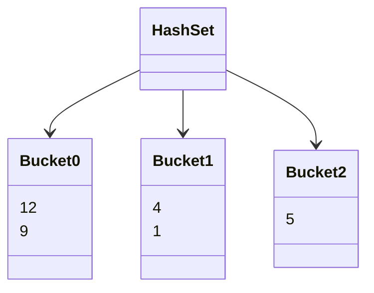

In this example, the set contains the elements `[1, 4, 5, 9, 12]`, spread over three buckets.

If we attempt to insert the element `4`, the set must first check whether `4` is already present. To do so, it needs to know which bucket to search in. The simplest algorithm to spread over an arbitrary number of values into a given number of buckets is to use the modulo operator:
```kotlin
/**
 * Decides in which bucket the given [value] could be found.
 * 
 * @param bucketNumber The number of buckets currently existing in the set.
 * @return The index of the bucket in which [value] may be found.
 */
fun chooseBucket(value: Int, bucketNumber): Int =
	value % bucketNumber
```

In this example, we can see that:

- `1 % 3 == 1`
- `4 % 3 == 1`
- `5 % 3 == 2`
- `9 % 3 == 0`
- `12 % 3 == 0`

This simple formula allows the set to know where to search any element in linear time. It also explains why growing a set can be an expensive operation: if the number of bucket changes, any elements may switch bucket, so all buckets need to be rebalanced. This is why the order of elements can change over time.

!!! info ""
	In the real world, the algorithms used may be slightly more complex, but the overall idea remains the same. For example, we haven't described how buckets are represented.

However, our imagined hashset cannot store non-integers: we can't use the modulo operator on a `Car`!

### The hash code

To solve this, the JVM authors enforced a simple rule: all objects must provide a way to convert themselves into a special integer dedicated to representing the object in modulo operations. By default, the JVM uses the object identity as it is guaranteed unique (a sort of 'pointer' to an object's position in memory, although that concept doesn't particularly make sense when we're talking about the JVM).

This enforcement is described in the class `java.lang.Object` (in Kotlin: `kotlin.Any`) in the form of the `hashCode` method:
```java
class Object {
	int hashCode();
}
```

When the set wants know where to put an element, it calls its `hashCode` method and uses the result in the modulo operations we described above to know which bucket to manipulate.

### A simple example

Let us create a set of the strings `"foo"`, `"bar"` and `"baz"`. The set will start with 3 buckets to avoid rebalancing. Thus, we start with:
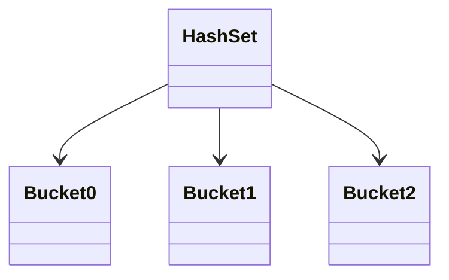

We first insert `"foo"`. Let's say its `hashCode` is 6877: `6877 % 3 == 1`, so we put it in the bucket 1.

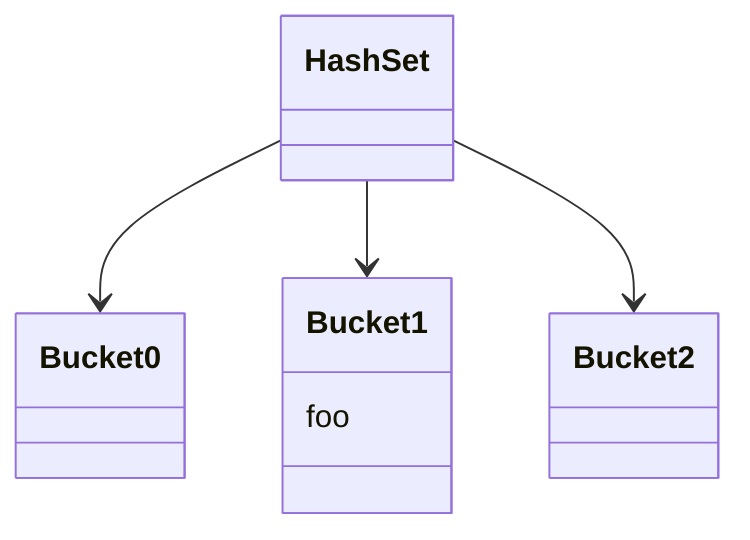
Let's add `"bar"` too, let's say it has the `hashCode` 3, so it goes into the bucket 0:
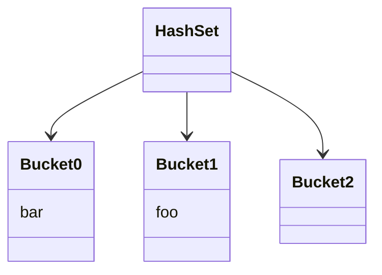

Finally, we add `"baz"`. Let's say its `hashCode` is 37, which also leads us to the bucket 1. That bucket already contains `"foo"`, but the set needs to decide whether `"foo"` and `"baz"` represent the same object (in which case only one should be added) or different objects (in which case both should be added).

One way to do so would be for the set to call `"foo".hashCode()` and compare it with `"baz".hashCode()` and interpret their possible difference as a difference in value. In practice, however, it is quite difficult to write `hashCode` methods that always return different values for different objects. For one, there are only ≈8 billion possible hash values, but many more objects could exist in a modern server.

Instead, the hashset uses the structural equality of the two objects to decide whether only one should be added (`"foo".equals("baz")`). If the bucket contains many elements, each of them must be tested one by one before `"baz"` can be added.
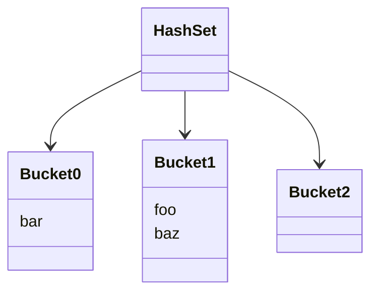

From this example, we get the following rules:

- **Two different objects are allowed to have the same hash**: after all, there could be more objects than possible hash values.
- **Two objects that are equal should always have the exact same hash**: otherwise, the set may search for one object in a different bucket than where it stored the other, and thus not realize the object is duplicated. Said differently, if `a.equals(b)` is `true`, then `a.hashCode() == b.hashCode()` must be `true`. We say that "`hashCode` is consistent with `equals`".
- **Two different objects should preferably have a different hash**: always returning a hash of `0` is technically allowed, but all objects will always be in a single bucket (vertical growth) whereas hashsets are only performant when spreading the elements over many buckets (horizontal growth).

While these rules are typically well-known (and are highlighted in the `hashCode` documentation), there exists a fourth rule that is less famous: **`hashCode` and `equals` are not allowed to change behavior for an object contained in a collection**. Let's see what happens if we break this rule.

### It's broken

Let's create a simple mutable class and implement `equals` and `hashCode`:
```kotlin
class Car(
	var year: Int
) {
	
	override fun hashCode() = year
	override fun equals(o: Any?) = o is Car && o.year == year
	override fun toString() = "Car($year)"  // for convenience
}
```

Here, two cars are considered equal if they were released in the same year. Two cars that are equal will have the same `hashCode` (mandatory according to the rules outlined above) and two cars that are not equal will have a different `hashCode` (optional, but important for performance).

We will create an empty set, add the car to the set, mutate it and add it again.
```kotlin
val car = Car(2007)
val set = HashSet<Car>()

set += car
car.year = 2008
set += car

println(set)
```
What do you think will be printed? Try it out!

<iframe src="https://pl.kotl.in/t5f20gzBr?theme=darcula" style="width: 100%; min-height: 450px" frameborder=0></iframe>

Normally, you should see that the set contains the car `Car(2008)` twice. If you don't, this could be because the hashing algorithm has changed in the JVM. In that case, try to change the years, you should easily find a combination where the set contains two elements.

Before we analyze this example deeper, notice that it only contains a _single_ `Car` instance. Not only does the set contain a duplicate, but it's a _single object_, not two distinct objects that happen to be equal.

Let's use the graphs to guess what happened. First, we create an empty set. For the sake of keeping the example short, let's say it contains three buckets:


We add the `Car(2007)`. `2007 % 3 == 0`, so we add it into the first bucket:


Now, we mutate the object that is already contained in the set by replacing the year from 2007 to 2008. The set has no way of knowing that the mutation has occurred, so nothing happens from its point of view. However, the object has indeed changed:
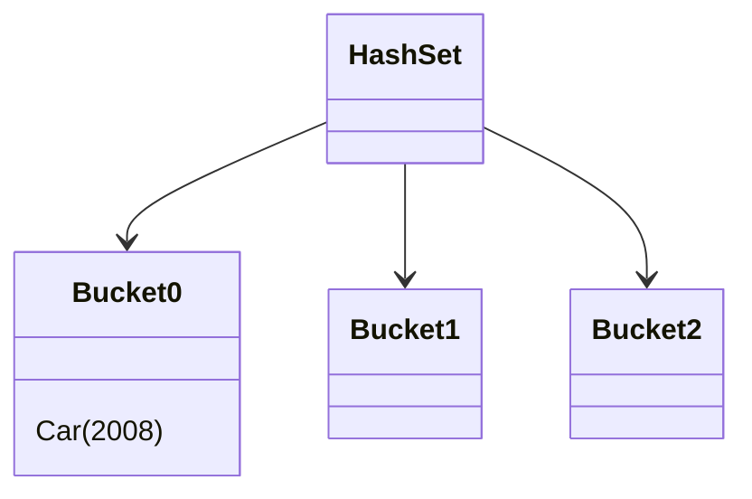

Now, we add the `Car(2008)`. `2008 % 3 == 1`, so we add it into the second bucket:
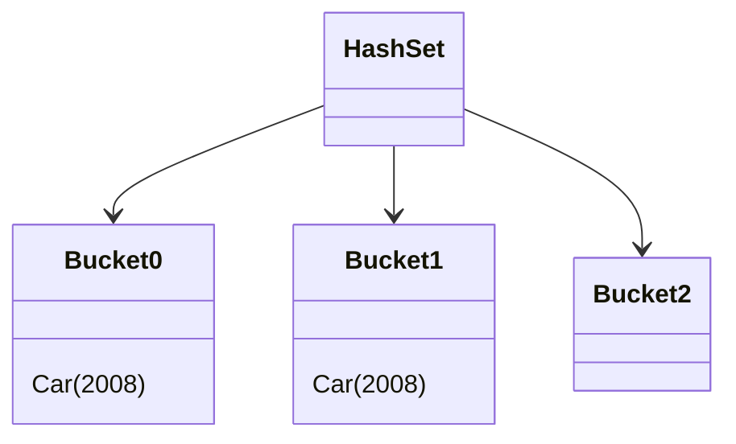

The set _never considered the other buckets_, so their content has no bearing on what happens. The set doesn't know that duplicates could be found in other buckets, as that is a violation of the `hashCode` contract: `hashCode` should never change while the object is stored in a hash-based data structure.

In practice, this means a set can contain the same instance at most `x` times, where `x` is the number of buckets.

Note that this problem isn't specific to the JVM or to Kotlin in any way. All languages and libraries that offer hash-based sets with interior mutability can break in this way. Notably, Rust doesn't allow elements of a set to mutate, so this problem cannot happen.

If you want to learn more about `equals` and `hashCode` in Java and Kotlin, see [this comparison article](../2024/better-java-2.md#items-1012-overriding-equals-hashcode-and-tostring).

## Linked hash-based sets

While hash-based sets are performant, their downside of not keeping element order can make them unsuitable for some situations. The simplest workaround is to maintain the element order with another data structure that can be quickly inserted into. The class `LinkedHashSet` does exactly this, using a linked-list to store the elements order.

In Kotlin, linked hashsets are the default set implementation used by many standard library functions, like `.toSet()` or `setOf()`, because most users expect collections to maintain insertion order and for the order to remain the same over time.

The set operates essentially identically, except that insertion operations also add a link in the linked list. Searching for an element is unchanged, the linked list is not traversed. However, when we want to iterate over the set, then we iterate over the linked list instead of iterating over the buckets.

Breaking a linked hashset happens the same way and has the same behavior as breaking a regular hashset: we can add the same instance multiple times to the set.

## Tree-based sets

Tree-based sets are completely different to the two types of sets mentioned previously. There are many multiple possible implementations, but for the purpose of this article the simplest one will do.

Tree-based sets are slower than hash-based sets, but have the advantage that elements are always sorted. All operations maintain the internal sort order, which is much cheaper to do than sort a list each time it is modified. If we want to continuously know the maximum of a collection, even as the collection changes, tree-based sets are a good solution.

### A simple example

The Kotlin standard library doesn't provide a `TreeSet` implementation—on the JVM, Kotlin can use Java's implementation. As an example, let's show a set that contains the elements `[1, 3, 5, 9, 12]`.

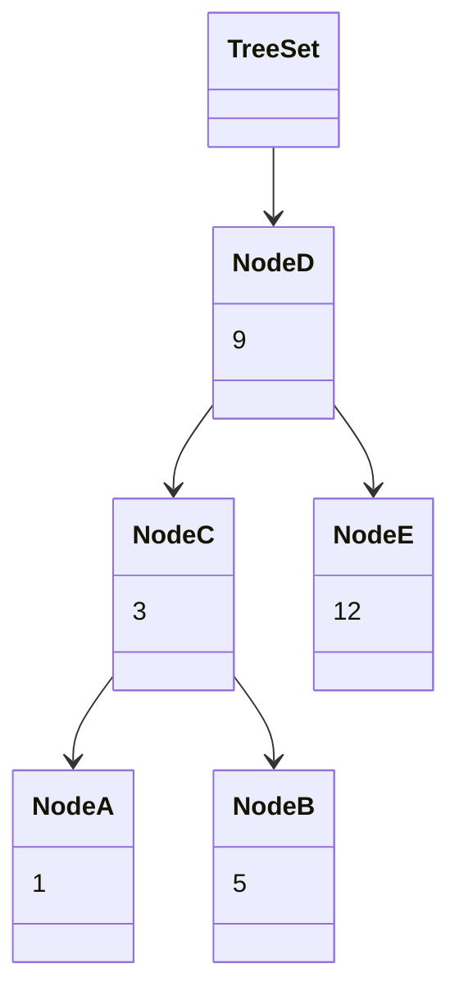

A TreeSet is organized into nodes that hold a single value, and have children organized into a specific way: all values left of them must be smaller. For example, the node C has the value `5`, and the only node on its left is the node A with the value `1`, that is indeed lesser.

The node D has the value `9`. On its left are the nodes A, B and C, with respective values `1`, `3` and `5`, which are all lesser.

To get a feel for how this set works, we'll insert the element `6`. We want to first discover whether the value is already present in the set, and then add it to the correct place.

1. Start at the root, which has the value `9`. Compare `9` and our value, `6`.
2. Because `6` is lesser than `9`, we know that, if it is present, it must be on the left of `9`. We therefore move one step down, to the node `3`.
3. Compare `3` and our value, `6`.
4. Because `6` is greater than `3`, we know that, if it is present, it must be on the right side of `3`. We therefore move one step down, to the node `5`.
5. Compare `5` and our value, `6`.
6. Because `6` is greater than `5`, we know that, if it is present, it must be on the right side of `5`. However, `5` doesn't have any children.
7. We now know that the set currently doesn't contain the element `6`. We can add `6` as a child of the node `5`.

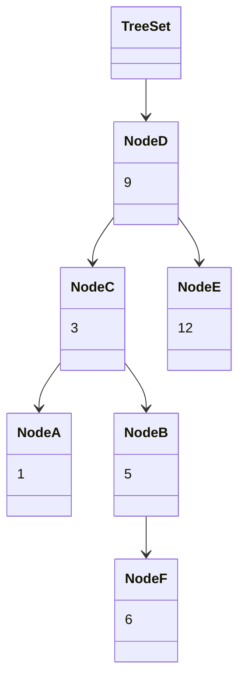

Although this new set does validate all the rules we mentioned, in practice it is suboptimal because the depth varies a lot between branches. Keep the set _balanced_, meaning that its depth is similar in all branches, makes performance more predictable. In the real world, the set would probably reorganize itself, but we can ignore this for today.

### Comparing arbitrary values

Here, we stored integer values, which are trivially comparable. Notice that we always do a single comparison at a time, between two elements. When we store arbitrary objects, we must have a way to compare them two-by-two, which is provided by the standard `Comparable` interface:

```java
interface Comparable<T> {
	int compareTo(T other);
}
```

Depending on the language, this function has a different signature. In Rust, for example, it returns an enum which contains the members `Less`, `Equal` and `Greater`. `Comparable` was added to Java in 1.2, and enums were only added in 1.5—instead, `compareTo` works with a convention that the return value is `0` if the two objects are equivalent, a positive integer if `this` is greater than `other`, and a negative integer if `this` is lesser than `other`. Note that the actual values are irrelevant, `-1` and `-26789` are treated exactly the same: as negative integers.

### It's broken

Once again, however, data structures don't like interior mutability. Let's explore what happens.

We will start with a `Car` implementation similar to our previous example, but adapted to implement `Comparable`:
```kotlin
class Car(
	var year: Int
) : Comparable<Car> {
	
	override fun compareTo(other: Car) = year.compareTo(other.year)
	override fun hashCode() = year
	override fun equals(o: Any?) = o is Car && o.year == year
	override fun toString() = "Car($year)"
}
```

First, we will create the set and add three cars. We keep a reference to the 2006 cars to easily mutate it later on:
```kotlin
val set = TreeSet<Car>()

set += Car(2009)
val car = Car(2006)
set += car
set += Car(2007)
println(set)
```
```text
[Car(2006), Car(2007), Car(2009)]
```

As expected, we obtain a set with three cars in increasing order of years. The set automatically sorted the elements even though we added the 2009 car first.

As a control, let's consider a car from 2008. Currently, it isn't contained in the set:
```kotlin
val target = Car(2008)
println("Does it have a $target car? ${target in set}")
```
```text
Does it have a Car(2008) car? false
```

So far, the set behaves exactly as we expect. Now, let's mutate the 2006 car into being a 2008 car:
```kotlin
car.year = 2008
println(set)
```
```text
[Car(2008), Car(2007), Car(2009)]
```

Notice that there is now a 2008 car in the set. However, it is placed incorrectly: it should be between 2007 and 2009. Again, the set cannot detect interior mutability and reorder itself—now that it is in an inconsistent state, things start to behave weirdly. 
When we ask whether the set contains a 2008 car, it answers no, even though it clearly does:

```kotlin
println("Does it have a $target car? ${target in set}")
```
```text
Does it have a Car(2008) car? false
```

However, it isn't because the set doesn't think they are equal, which we can verify using `equals` and `compareTo` ourselves:
```kotlin
println("Are equal?            ${car.equals(target)}")
println("Are comparable equal? ${car.compareTo(target)}")
```
```text
Are equal?            true
Are comparable equal? 0
```
Clearly, both `equals` and `compareTo` agree that both 2008 cars are identical.

Presumably, the set is currently structured as:
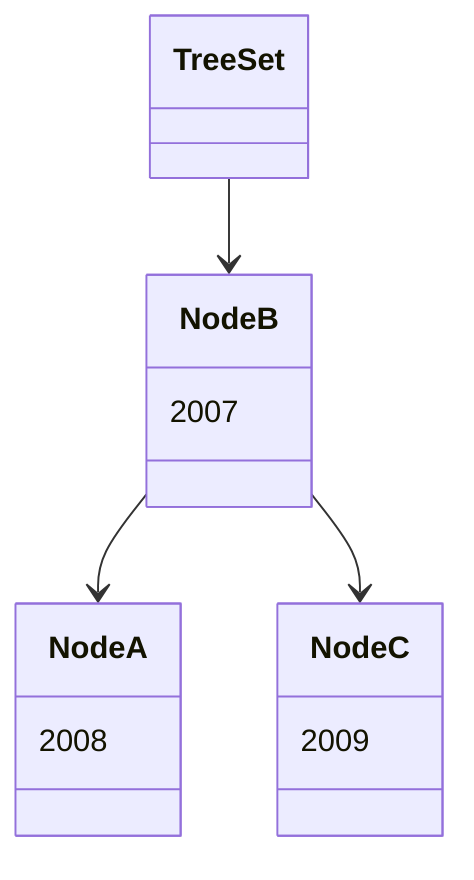

When searching for a 2008 car, the set starts with the root, 2007. Since 2008 is greater than 2007, a 2008 car must be on the right. There, it only finds 2009, so it decides that there is no 2008 car.

Now that we've convinced the set of something impossible, let's take the confusion further, and add the 2008 car a second time.
In theory, the set should do nothing. However, in practice:
```kotlin
set += car
println(set)
```
```text
[Car(2008), Car(2007), Car(2008), Car(2009)]
```

We have now added the same 2008 car instance to a set twice. 
Presumably, the set now looks like:
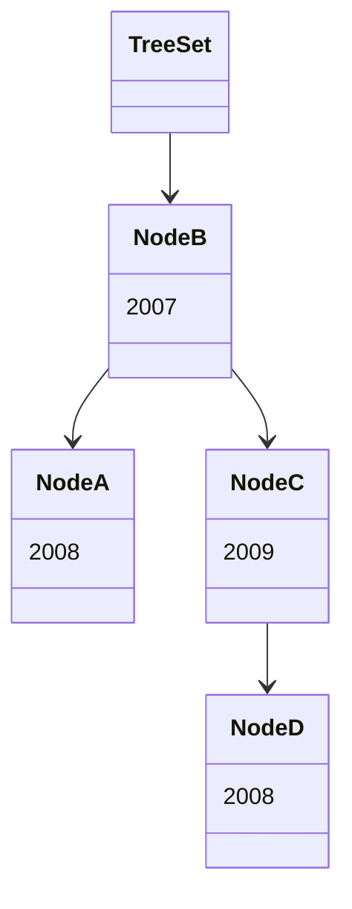

This is interesting, because there is now a 2008 car placed where a 2008 car should be. That one can be found by the set:
```kotlin
println("Does it have a $target car? ${target in set}")
```
```text
Does it have a Car(2008) car? true
```

If you want to break this set further, you can use this sample:

<iframe src="https://pl.kotl.in/VY_8wGoE7?theme=darcula" style="width: 100%; min-height: 800px" frameborder=0></iframe>

As we can see, interior mutability breaks this kind of sets too, allowing the addition of the same instance multiple times in the set.

## Maps

Although this article was primarily about sets, maps have the same behavior. We can think of maps as sets of keys that additionally carry a value. In fact, the Java, Kotlin and Rust standard libraries implement sets as special maps which _don't_ carry a value.

In Java and Kotlin, we thus find `HashMap`, `LinkedHashMap` and `TreeMap`.

Because the exact same algorithm and implementation is used under the hood, map keys can break in the exact same ways as showcased previously in this article.

## Conclusion

**Avoid interior mutability!** Mutability in general should be avoided because immutable data structures are easier to reason about. Mutating elements contained in collections (or other data structures not mentioned in this article) very often breaks their assumptions about the stored data.

Usually, the conclusion of these articles is nuanced with specific examples where ignoring the rule is beneficial. For once, though, I can't think of an example where breaking a set or a map is a good idea, other than for learning about them, of course.
