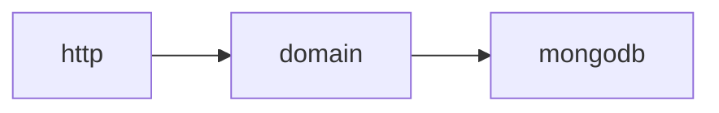
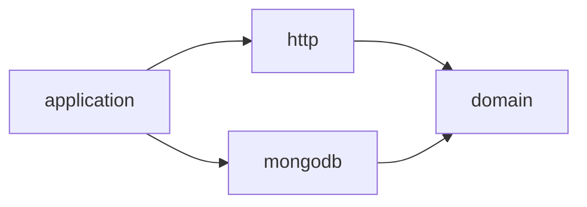
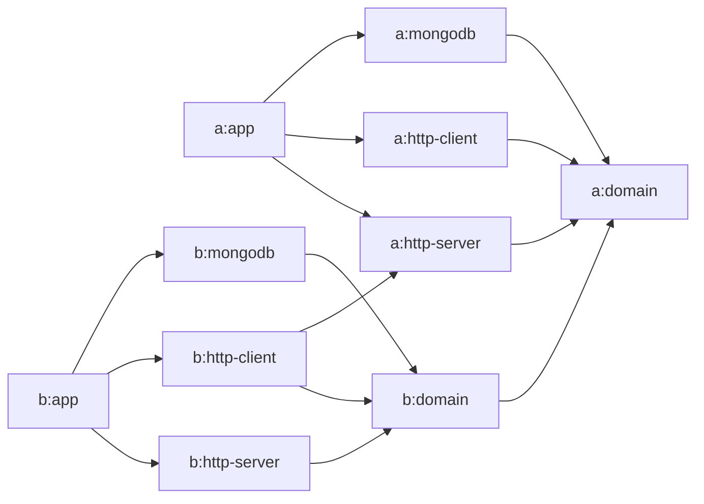
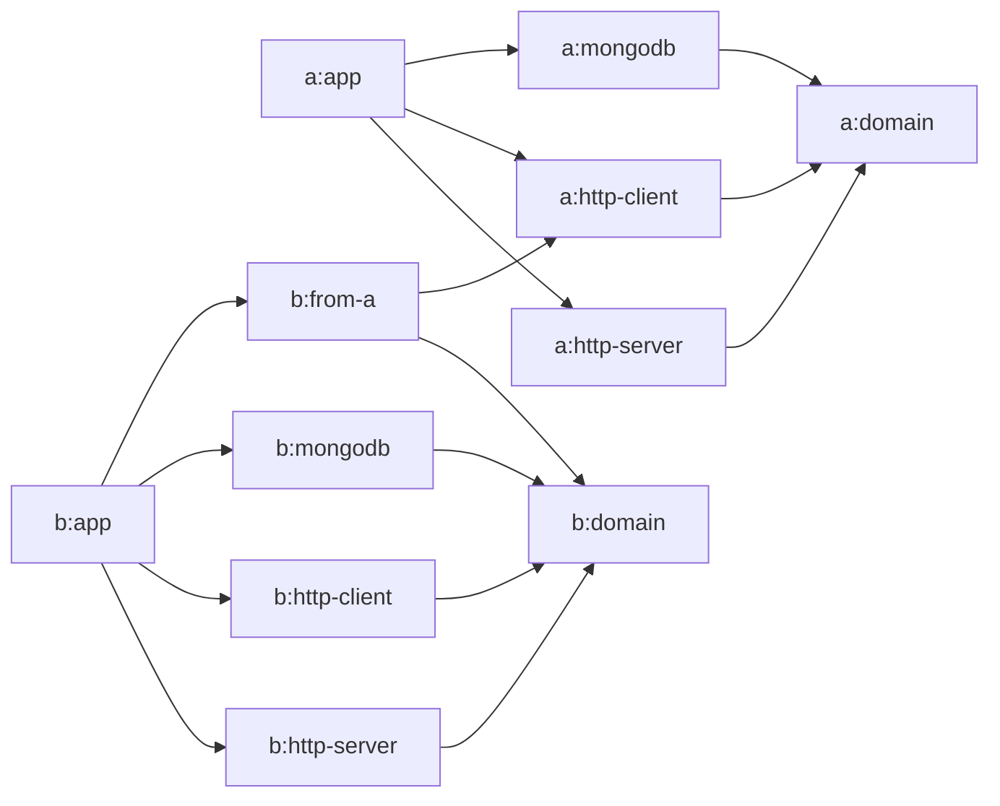

# What is really hexagonal architecture?

Hexagonal architecture is one of the most popular software architectures at the moment.
Let's dive into what it is, what it isn't, and how to know when a project isn't benefitting from it.

<!-- more -->

## What is a component?

In this post, I define a “component” to mean a single element of a distributed system. For example, in traditional server–client architecture, the server is a component, and the client is another one. If you were making a standalone desktop application, it would be a single component by itself. If it needed to interact with other applications, they may be their own component. In a microservice deployment, each microservice is a component.

Components are subdivided into multiple modules or packages; the important distinction is that communication within a component usually happens in-memory (through direct function calls), whereas communication between components usually happens through an I/O boundary (network, file systems…).

Depending on the workflow, different components may be developed by different teams, or different people in a team may specialize in different parts of a component. What's important is that a component is more or less independent of others: it is usually a single binary that can be started even if other components are not available on the machine. Of course, if it depends on them, it may immediately crash, but it can still be started by itself.

## Looking at the past

Components are often recognized to be the basic unit of a deployment. The question of how to architecture components has always been at the forefront of software design, and trends have changed quite a bit. Let's mention a few influential movements.

### Monolithic architecture

Monolithic is simple in mental model: essentially, there are no particular rules imposed on modules within a component. A component is rarely composed of multiple modules, instead having all code in a single one, where anything can access anything else.

Monolithic architecture is simple to understand, and is often the default path for new projects. However, the flexibility often ends up being more and more of a cost as the component becomes resistant to change: since anything can use anything else, editing a part of the component often leads to having to update a longer and longer thread of impacted places. For the same reason, it is often impossible to isolate parts of the component for testing.

Its simplicity is an important advantage, though. Monolithic designs often require less code than the approaches described further in this article, and tend to be more performant because fewer abstractions are used. For these reasons, some major projects prefer monolithic design, most notably the Linux kernel.

### Layered architecture

Layered architecture is a first attempt at organizing the codebase of a component to make it more prone to change in the future. The underlying idea is to create modules around the flow of data. For example, a typical server is decomposed into the reception and decoding of requests, processing changes, and persisting the results into a database. 

In layered architecture, a typical server component could have the following modules: `http`, which depends on `domain`, which depends on `mongodb`.



The `http` module would contain code related to handling requests, authentication, authorization, timeouts, etc. Each endpoint would then call a method from the `domain` module, which would implement business verification, querying the `mongodb` module to access data as needed, then sending the result back to the `mongodb` module for persisting. Finally, the `mongodb` module would contain code to communicate with the database.

!!! tip "Naming modules"
    The question of naming modules comes quite often, with two main groups of people: those who name the module after its _role_ (“persistence”, “network”…) or after its technology (“mongodb”, “http”…). Personally, I fall into the latter group: modules exist to allow me to replace parts of the component with newer code without having to rewrite everything. This implies that, at some point, I will have more than one module with the same role, at which point their most important discerning feature will be the technology they are based on.

Layered architecture is a first attempt at quarantining code based on its role. All code related to HTTP requests is in the HTTP module, all business rules are in the domain, all MongoDB interactions are in the MongoDB module. Domain code cannot access MongoDB primitives, but it can access the public API of the MongoDB module.

Layered architecture implies more organization than monoliths, but it doesn't require much more code, so it is often a popular way to break a monolith down into modules that are easier to evolve. In particular, we see that if we wanted to expose a WebSocket API, we could create another module that depended on the domain, without impacting anything existing. However, layered architecture has a flaw: the domain depends on the database. This has a number of inconvenient consequences:

- The code of the domain works with the same representation as the database. Being database-first is not necessarily an issue, but it means that rewriting your schema will mean rewriting large parts of the domain, and thus probably large parts of the HTTP module as well.
- Using the domain without the database is near-impossible. In particular, it becomes hard to unit test the domain, which is a shame, since the domain is usually where the most logic is, and therefore the most useful to unit test.
- The structure of the domain can quickly become a reflection of the database, which means it may not necessarily align with the best way to represent the business logic.

!!! quote "Opinion"
    An argument that is often brought up is that layered architecture blocks you from switching the database to another one.
    I don't find this point very convincing, especially because I've never seen anyone _want_ to change databases without also wanting to redesign most of the component, requiring an entire rewrite anyway.

    Of course, survivorship bias and all that—maybe it's _because_ the application is layered that full rewrites are this common.

Many people thought of this problem, and many architecture candidates were created. Let's discuss the most popular one, hexagonal architecture.

### Hexagonal architecture

Hexagonal architecture attempts to take the best part of layered architecture (that the HTTP code is completely de-correlated from the domain) and push the same logic to the database.

For this, it creates three important concepts:

**The domain module**

:   **The domain module represents the business rules in their purest form.** It is independent of anything else in the project and can be compiled and unit tested by itself. It is easy to read for anyone who knows programming, and represents business rules clearly without obstructions.

    The goal is for the domain module to be completely isolated from technical concerns. Is the component using HTTP to communicate with its clients? Is the component storing its data in MongoDB or Cassandra? The domain module doesn't know, and doesn't care.

    If you migrated from a web framework to another, not a single line in the domain module should change.

    This means that the domain module should be very strict when it comes to adding new dependencies: only those that are strictly necessary to model the business processes should be used. In a typical Kotlin project, this may mean the standard library, [Arrow Typed Errors](https://arrow-kt.io/learn/typed-errors/), [KotlinX.Coroutines](https://kotlinlang.org/docs/coroutines-overview.html) and [KotlinX.Datetime](https://github.com/Kotlin/kotlinx-datetime). Libraries like [Ktor](https://ktor.io/), [KotlinX.Serialization](https://github.com/Kotlin/kotlinx.serialization) or [KotlinX.RPC](https://github.com/Kotlin/kotlinx-rpc) should not appear in the domain module nor in any of its transitive dependencies.

    In general, this property means that hexagonal architecture is incompatible with all-encompassing web frameworks like Spring, that enforce a specific way of writing code even in the domain module.

**Ports**

:   **Ports are modules that allow the external world to interact with this component.** For example, HTTP endpoints, WebSocket APIs, but also CSV exports and anything else that lets the external world access the component.

    Ports are essentially identical to the leafmost modules in layered architecture: they depend on the domain, and call its functions directly.

    Because ports are dedicated to technical concerns, like the specific choice of web technology, it is completely normal that they depend on very specific libraries to achieve their goals. If a technology needs to change in the future, this is not a setback to the project: only this specific port module needs to be rewritten, and the old one can be kept during the migration.

    Ports are not allowed to know or depend on other ports or adapters.

**Adapters**

:   Adapters are similar to ports, but the other way around. **They are dedicated modules that allow the domain to access the external world.** Remember: the domain is not allowed to have external dependencies, but it may still need to access data from elsewhere.

    The way the domain accesses external data through an adapter is via inversion of control, also called [dependency injection](di-without-frameworks.md): the domain declares interfaces (or traits, or type classes, or whatever else your language has) with methods that correspond to the data it would like to get, or the operations it wants to be able to do. Adapter modules depend on the domain, and implement these interfaces.

    At no point can the domain call the functions directly: instead, it is configured with a valid implementation of all the interfaces it wants, and delegates the operation to them. In turn, adapter modules, similarly to ports, have access to any library they may need.

    Most often, adapters are used to implement persistence layers by interacting with databases.

    Adapters are not allowed to know or depend on other ports or adapters.

**The wiring module**

:   Since ports and adapters don't know about each other, the component ends up becoming a loose group of modules that can't interact. A final module—the wiring module—often called `application`, is tasked with combining all the modules into a proper component. It often contains the `main` function, reads the configuration and instantiates services from the various modules with the correct parameters to access each other.  

    The wiring module should contain as little code as possible: its purpose is just to assemble the modules as puzzle pieces.

## Let's recap

Our business logic is entirely in the domain module, written as simple functions. It doesn't use any frameworks, and it is as simple to read as possible. Anyone who knows the programming language used, even if they are complete newbies and know nothing of the tech stack, can navigate it and understand what the module _does_ and _what the user expects_.

Any time the domain module wants to access data from outside itself, it declares an interface. For example, if the domain module wants to create and list notes, it would define:
```kotlin
// The domain is responsible for choosing the representation.
class Note(
	val name: String,
	val starred: Boolean,
) {
	
	init {
		// Validation rules
		require(name.isNotBlank()) { "A note's name shouldn't be blank" }
	}
}

// The domain module exposes an interface to perform 
// external actions it isn't allowed to execute itself.
interface NoteRepository {
	
	suspend fun create(note: Note)
	
	suspend fun get(name: String): Note?
}
```

Then, an adapter module implements this interface to actually perform what the domain intended:
```kotlin
@Serializable
class NoteDto(
	val name: String,
	val starred: Boolean,
)

class MongoNoteRepository(
	private val database: Database,
) : NoteRepository {
	
	private val collection = database.getCollection<NoteDto>("notes")
	
	override fun create(note: Note) {
		database.insert(note.toDto())
	}
    
	override fun get(name: String): Note? =
		database.findOne {
			NoteDto::name eq name
		}?.toDomain()
}

// Conversion function Domain → DTO
// Conversion function DTO → Domain
```

The domain is exposed to the outside world by creating a new module that depends on it and can call its functions. Finally, an Application module depends on all other modules and instantiates everything at the start of the process.

We thus have the following graph of dependencies:



The reasons we do all of this work are many:

- The domain is completely isolated from the tech stack. At any point, we can entirely swap any parts of the tech stack by another option, and the domain is unchanged.
- The same is true if we want to add a new alternative. For example, we have an existing HTTP API and want to add a gRPC API.
- Or, we could expose an HTTP V1 and an HTTP V2 API.
- Since we can have alternatives, we can also perform incremental migrations that are completely invisible from the user's perspective. No big bang migrations anymore!
- If we depend on an external service, and it suddenly changes APIs, we can easily replace its adapter without impacting the rest of the component.
- We can swap out all adapters by fake/mock/in-memory implementations, and we immediately have a lightweight version of our component that can be used for testing, or for quick prototyping with the client if the adapters aren't implemented yet. After all, the business rules won't change when the adapters do! Since the adapters are usually the time-consuming part, we can get user feedback before even starting to architecture our databases.

Together, these points mean **the end of full project rewrites**.

But—that's the theory. In practice, full project rewrites still happen. Why?

In my opinion, it's because the above rules are actually much stricter than they appear at a glance. Many people believe they are following them, but are actually being too lax, costing them almost all benefits.

## Within a component

### No common utilities!

When developing a hexagonal project, especially when using microservices, we often realize that we end up writing the same code all the time in all the domain modules. For example, code to represent "external entities" using some kind of identifier or reference. Code to represent authentication, or helper for common validation.

Here, we have two choices: either accept that we're going to duplicate these features, probably change them slightly as we create new microservices, and watch them diverge as they are tested differently. In time, our microservices become so different that users can see them behave differently.

Or, we could create a common utility module to store all these common things! But, tough luck, this can be even more harmful than duplication. First, because of the "bunch of utilities" mentality: this common module will end up with more and more random functions that are useful to two or more modules, with no particular coherence. Since they're an "aside" of stuff that is pulled there while you're trying to accomplish your real goal in one of the components, they probably won't be tested as much as "proper code". **And that's a shame, because the common module will be the cause of the next rewrite.** The more random code is put in there, the more the other domain modules depend on it, the more its modeling will influence the other domains. Since these are just a bunch of utilities that are added one by one, you probably didn't spend much time on conception for them, right? Well, all domains are now based on the low-effort module.

If you're going to have a common domain module, it must be approached in the same way one would approach developing an open source library: utmost care for compatibility and testing, with high quality cohesive components that can be replaced without changing the API surface. But, doing this requires a knowledge and experience that is very different from regular application programming, and is rarely available in companies. Even _if_ the kind of people to do this _were_ available, it's unlikely that they would be given the time to actually make it right. The "just a bunch of utilities" mentality isn't only between developers, it also influences shareholders, who would much prefer working on the new shiny feature than polishing what is ultimately the foundation of the other project. But when the foundation is shaky, it doesn't matter what you build on top.

Note, however, that the problem is not nearly as bad when creating common utility modules for ports or adapters. **Full rewrites are almost always caused by problems in the domain modules.** If the utilities are shared between all adapters of a specific technology… worst case, all adapters for that technology are rewritten together. This can still be done incrementally while continuing to develop the overall project: users may observe a slowdown in development while this is ongoing, but there won't be a need for a full feature freeze while the rewrite takes place.

So: avoid polluting your domain module, no matter the reason. Each component's domain must remain pure if you want them to last.

### The use of DTOs

DTO (Data Transfer Object) is a pattern that boils down to creating classes specifically for the purpose of interacting with external systems. For example, instead of using your ORM or database layer of choice with your domain objects, you use a dedicated class specifically written for being stored in the database. Of course, this means you have to write code to convert between the domain and DTO representations.

I've seen many people avoid DTOs entirely: after all, ports and adapters are allowed to depend on the domain, right? Why shouldn't you use the domain objects themselves in the database or in the API?

The thing is, when hexagonal architecture says dependencies flow from the domain to ports and adapters, it has a deeper meaning that we may initially think. Let's review an example: imagine you're working on a codebase that doesn't have DTOs for its HTTP API, instead using the domain objects directly. You're implementing a new feature: previously, users were part of a single organization; now, they can join multiple. You open the domain, edit the `User` class to switch the `organization` field from a reference to a list of references. And… stop! You broke the HTTP API. There was no warning. The code still compiles fine. All the domain tests pass. If you're lucky, you have good enough integration tests to catch it, but, most likely, this will go unnoticed until a user complains about the API having changed without warnings.

So, why is that? That is because the HTTP API and the domain module are _strongly coupled_: changing one impacts the other directly. When editing the domain, we now have to take into account how the HTTP API will be impacted. **This is a dependency!** Our domain module has an implicit dependency on the HTTP API. Sure, this dependency doesn't appear in our build tool, but that actually makes it worse: not only is our domain tainted by technical concerns, but new developers won't even know about it until they get bitten. After all, it's not written anywhere.

DTOs introduce a mapping layer between the domain and the external representations. When the domain changes, the DTOs can stay the same, or change in different ways to accommodate their specific situation. This ensures that we are free to change the domain however and whenever we want. Our project becomes much more resistant to change.

Actually, the DTOs aren't that important. What's important is the mapping layer that will absorb changes instead of propagating them. Let's take a JSON API example with DTOs:
```kotlin
@Serializable
private class UserDto(
	val name: String,
	val starred: Boolean = false, //(1)!
)

// The mapping functions absorb breaking changes
private fun User.toDto() = UserDto(name = name, starred = starred)
private fun UserDto.toDomain() = User(name = name, starred = starred)

// Here, we declare our endpoints
suspend fun Routing.userRoutes() = route("/users") {
	post {
		val user = call.receive<UserDto>()
		userService.create(user.toDomain())
	}
    
	get {
		val id = call.receive<String>()
		val user = userService.get(id)
		call.respond(user.toDto())
	}
}
```

1.  In this example, `starred` has a default value even though it doesn't have one in the domain.
    One reason this could happen is if `starred` was added to the API after the class was created.
    Thanks to the default value, old users that do not know about this field can continue interacting
    with the API without issues.

Here, the DTO isn't that useful. It exists because serialization libraries often generate magic code by looking at classes, but really, we can get all the same benefits without declaring a new class.

```kotlin
// The mapping functions work with JSON directly
// They serve the exact same role
private fun User.toJson() = JsonObject {
	field("name", name)
	field("starred", starred)        
}
private fun JsonObject.toUser() = User(
	name = get() ?: error("Missing mandatory field 'name': $this"),
	starred = get() ?: false,
)

// We declare our endpoints in the same way
suspend fun Routing.userRoutes() = route("/users") {
    post {
        val user = call.receive<JsonObject>()
        userService.create(user.toUser())
    }

    get {
        val id = call.receive<String>()
        val user = userService.get(id)
        call.respond(user.toJson())
    }
}
```

As far as hexagonal architecture is concerned, these two examples are equivalent. Both provide the same safety and stability guarantees for the future. So, really, it's a style decision.

Lastly, if you were considering using an implicit mapping library like [MapStruct](https://mapstruct.org/)—please don't. The whole point, here, is to recognize the value in the mapping functions. These are the most likely pieces of the module to break and change in the future, that's the entire reason they exist. Understanding what they do or don't map is critical and should thus be kept as independent of magic as possible.

## Interactions between components

In a microservice deployment, you most likely have many components that interact with each other via some kind of API. How do you represent this relationship?

Many projects solve this by adding a dependency between the domain modules of the two components, and adding a dependency from the HTTP client adapter of the dependant module to the HTTP server port of the dependency module.



Again, a domain depending on anything from the external world is the quickest way to introduce coupling that will cause a rewrite in the future. The domain now "knows" about something in the external world, and if that thing changes, it must change as well.

Instead, the components should be kept separate. The dependent module should declare the data it wants to obtain with a repository interface, exactly as we did when accessing a database. Then, a new adapter must be written to fulfill these requests. That adapter is allowed to access data from the external world:



In this version, `b:domain` must redefine all classes it wants from `a:domain`, but it only declares the fields it directly has a use for. It also defines an interface with all the different endpoints it wants to access, again with only the fields it is interested in. The adapter module is responsible from converting these 'pseudo-endpoints' into real requests that are executed to the component `a` via its `a:http-client` port.

This way, the isolation of the domains is guaranteed, so they will be able to withstand major refactors to the entire project with little impact. Hopefully, they can be kept for the years to come, even if the entire tech stack changes, or if an entire microservice gets deleted or split/recombined with others.

### Death by a thousand abstractions

As you may have noticed, the answer to basically any problem, when using hexagonal architecture, is to introduce a mapping layer in some module that has minimal access and impact on the rest of the world.

This approach is very efficient in creating buffers that protect against changes in other modules: if another module gets removed, changes its API, or is otherwise rewritten, the buffer module is impacted, but not anything after it. This does make the protected pieces much more likely to continue working for a long time.

But, it's also a lot of boilerplate. Each time a microservice wants to access data from another one, you must write a local representation of the requested data, an interface that describes how it will be accessed, an adapter module with its own DTOs, mapping and request logic. All of this is a lot of work for what would be a single function call in a monolith. **One of the downsides of hexagonal architecture is that sacrificing on even one of these steps basically cancels out all stability benefits it would have otherwise granted**—so, in practice, we see many codebases that implement hexagonal architecture halfway, have lots of boilerplate, and none of the benefits.

And, finally, each of these mapping layers cuts down on the flexibility of the wrapped tool. Let's imagine you want to use OpenTelemetry in your microservices. You want to declare telemetry events from your domains, but you don't want to directly depend on the OpenTelemetry library, since it's a technical concern. So, you create the interface and adapter dance with the functionalities that are the most important to you. But, OpenTelemetry is actually _very_ flexible, and it's unlikely your wrapper will be able to expose all this functionality—again, this would the job for a library author, and you're most likely not one, or if you are, you don't have the budget to make this high-quality enough.

Sadly, this is something application developers can't really do anything about. So, **here's my plea to library authors**: when you're developing something that is meant to be used as part of the domain, please always expose a different artifact that only contains your main objects as interfaces. This way, if a user wants to migrate away from your library in the future, or someone develops an alternative version, or even just if you want to make breaking changes—you can introduce a thin wrapper on top of another library that implements the same API artifact.

## Conclusion

Hexagonal architecture isn't even my preferred software architecture, most notably because it makes horizontal scalability near impossible, and it leads to under-usage of databases—but, that's a story for another time.

I do appreciate that hexagonal architecture attempts to make components independent of each other in a way that is designed to outlast any of them. Sadly, actually attaining that requires an understanding and application so strict that it is out of the reach of most application developers. The average application developer doesn't have the time to think of things to this deep a level, and shortcuts will always be taken whenever the deadline asks for it.

Hexagonal architecture will always stay in my mind as one of these things that are great in theory when perfectly executed, but are doomed to fail in practice. Like having a properly configured Gradle project, eh.

On that, good night, and I'll try to keep these posts shorter. Three evenings to write one is _way too much_.
