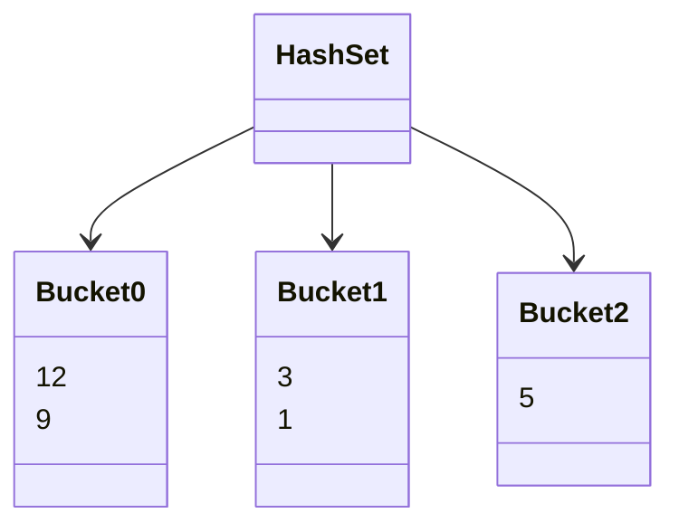
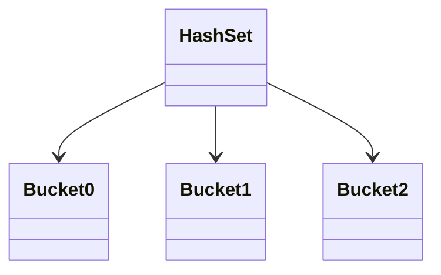
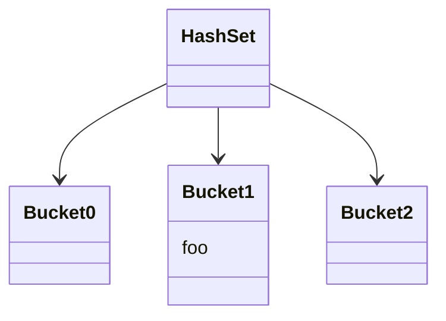
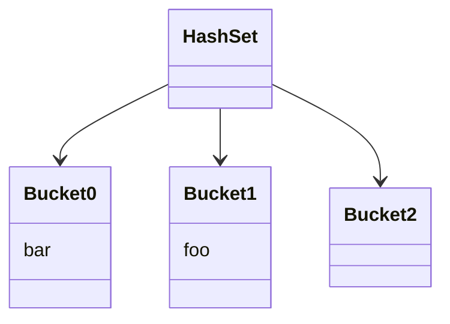
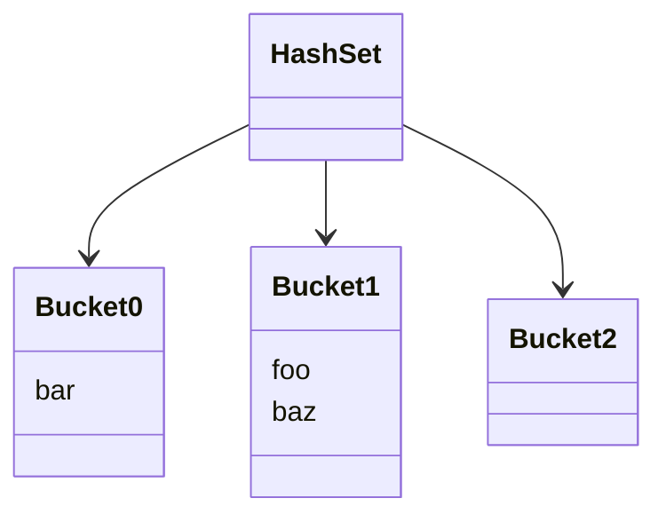
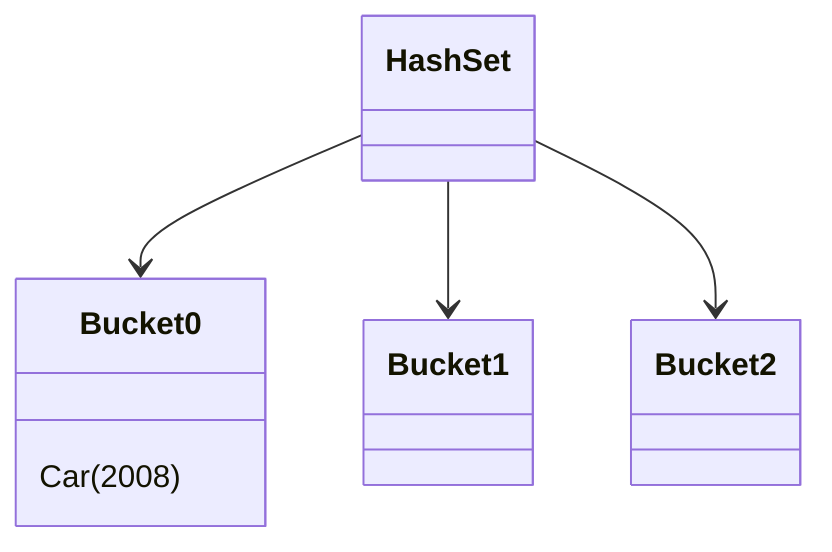
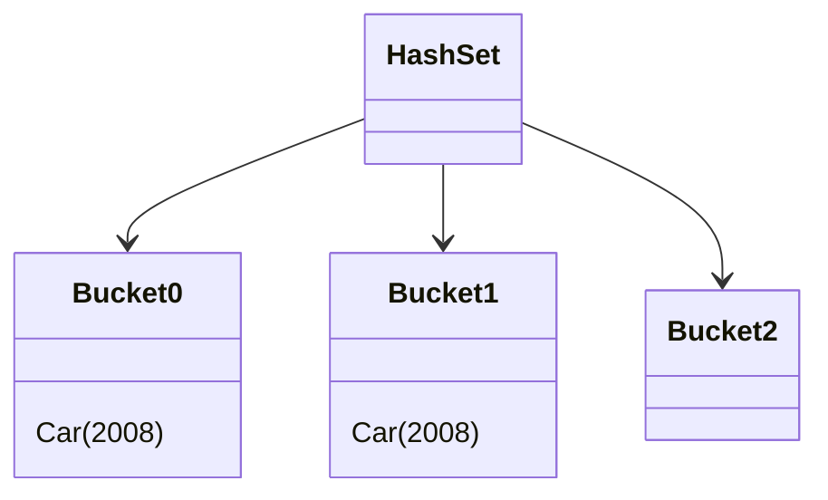

# Back to basics: When sets break

Sets are one of the most basic data structures of modern programming. Unlike arrays, sets require the data to confirm to a few invariants. Let's review what they are, and what happens when we break them.

<!-- more -->

## What are sets

Sets are data structures specialized in one task: **storing elements without allowing duplicates**. Unlike arrays, sets usually aren't hardware-implemented, so programming languages provide their own implementations.

A set could be created on top of an array, which would use an optimal amount of memory. However, such a set would need to scan through all existing elements during insertion to know if the inserted element already exists. We usually expect that sets are performant when inserting elements, so this implementation is rarely seen in practice.

In the real world, the most common types of sets are:

- Hash-based sets
- Linked hash-based sets
- Tree-based sets

We will review each one, its invariants and what happens when we break them.

## Hash-based sets

Hash-based sets are traditionally the faster and less memory-hungry set implementations. While they use more memory than arrays, they are still more lightweight than other sets. Their main downside is that the order of elements is not guaranteed and may change over time.

### A primitive implementation

Hash-based sets are implemented by splitting elements into multiple buckets. The cleverness is that the set is able to know in advance in exactly which bucket (singular) any element could be found. All operations therefore only ever apply to a single bucket, and the number of buckets doesn't impact the number of executed operations. This lets the set grow to very large sizes without performance decreasing, as the set will resize into more buckets each time a single bucket becomes too large.



In this example, the set contains the elements `[1, 3, 5, 9, 12]`, spread over three buckets.

If we attempt to insert the element `3`, the set must first check whether `3` is already present. To do so, it needs to know which bucket to search in. The simplest algorithm to spread over an arbitrary number of values into a given number of buckets is to use the modulo operator:
```kotlin
/**
 * Decides in which bucket the given [value] could be found.
 * 
 * @param bucketNumber The number of buckets currently existing in the set.
 * @return The index of the bucket in which [value] may be found.
 */
fun chooseBucket(value: Int, bucketNumber): Int =
	value % bucketNumber
```

In this example, we can see that:

- `1 % 3 == 1`
- `3 % 3 == 1`
- `5 % 3 == 2`
- `9 % 3 == 0`
- `12 % 3 == 0`

This simple formula allows the set to know where to search any element in linear time. It also explains why growing a set can be an expensive operation: if the number of bucket changes, any elements may switch bucket, so all buckets need to be rebalanced. This is why the order of elements can change over time.

!!! info ""
	In the real world, the algorithms used may be slightly more complex, but the overall idea remains the same. For example, we haven't described how buckets are represented.

However, our imagined hashset cannot store non-integers: we can't use the modulo operator on a `Car`!

### The hash code

To solve this, the JVM authors enforced a simple rule: all objects must provide a way to convert themselves into a special integer dedicated to representing the object in modulo operations. By default, the JVM uses the object identity as it is guaranteed unique (a sort of 'pointer' to an object's position in memory, although that concept doesn't particularly make sense when we're talking about the JVM).

This enforcement is described in the class `java.lang.Object` (in Kotlin: `kotlin.Any`) in the form of the `hashCode` method:
```java
class Object {
	int hashCode();
}
```

When the set wants know where to put an element, it calls its `hashCode` method and uses the result in the modulo operations we described above to know which bucket to manipulate.

### A simple example

Let us create a set of the strings `"foo"`, `"bar"` and `"baz"`. The set will start with 3 buckets to avoid rebalancing. Thus, we start with:


We first insert `"foo"`. Let's say its `hashCode` is 6877: `6877 % 3 == 1`, so we put it in the bucket 1.


Let's add `"bar"` too, let's say it has the `hashCode` 3, so it goes into the bucket 0:


Finally, we add `"baz"`. Let's say its `hashCode` is 37, which also leads us to the bucket 1. That bucket already contains `"foo"`, but the set needs to decide whether `"foo"` and `"baz"` represent the same object (in which case only one should be added) or different objects (in which case both should be added).

One way to do so would be for the set to call `"foo".hashCode()` and compare it with `"baz".hashCode()` and interpret their possible difference as a difference in value. In practice, however, it is quite difficult to write `hashCode` methods that always return different values for different objects. For one, there are only ≈8 billion possible hash values, but many more objects could exist in a modern server.

Instead, the hashset uses the structural equality of the two objects to decide whether only one should be added (`"foo".equals("baz")`). If the bucket contains many elements, each of them must be tested one by one before `"baz"` can be added.


From this example, we get the following rules:

- **Two different objects are allowed to have the same hash**: after all, there could be more objects than possible hash values.
- **Two objects that are equal should always have the exact same hash**: otherwise, the set may search for one object in a different bucket than where it stored the other, and thus not realize the object is duplicated. Said differently, if `a.equals(b)` is `true`, then `a.hashCode() == b.hashCode()` must be `true`. We say that "`hashCode` is consistent with `equals`".
- **Two different objects should preferably have a different hash**: always returning a hash of `0` is technically allowed, but all objects will always be in a single bucket (vertical growth) whereas hashsets are only performant when spreading the elements over many buckets (horizontal growth).

While these rules are typically well-known (and are highlighted in the `hashCode` documentation), there exists a fourth rule that is less famous: **`hashCode` and `equals` are not allowed to change behavior for an object contained in a collection**. Let's see what happens if we break this rule.

### It's broken

Let's create a simple mutable class and implement `equals` and `hashCode`:
```kotlin
class Car(
	var year: Int
) {
	
	override fun hashCode() = year
	override fun equals(o: Any?) = o is Car && o.year == year
	override fun toString() = "Car($year)"  // for convenience
}
```

Here, two cars are considered equal if they were released in the same year. Two cars that are equal will have the same `hashCode` (mandatory according to the rules outlined above) and two cars that are not equal will have a different `hashCode` (optional, but important for performance).

We will create an empty set, add the car to the set, mutate it and add it again.
```kotlin
val car = Car(2007)
val set = HashSet<Car>()

set += car
car.year = 2008
set += car

println(set)
```
What do you think will be printed? Try it out!

<iframe src="https://pl.kotl.in/t5f20gzBr?theme=darcula" style="width: 100%; min-height: 450px" frameborder=0></iframe>

Normally, you should see that the set contains the car `Car(2008)` twice. If you don't, this could be because the hashing algorithm has changed in the JVM. In that case, try to change the years, you should easily find a combination where the set contains two elements.

Before we analyze this example deeper, notice that it only contains a _single_ `Car` instance. Not only does the set contain a duplicate, but it's a _single object_, not two distinct objects that happen to be equal.

Let's use the graphs to guess what happened. First, we create an empty set. For the sake of keeping the example short, let's say it contains three buckets:


We add the `Car(2007)`. `2007 % 3 == 0`, so we add it into the first bucket:


Now, we mutate the object that is already contained in the set by replacing the year from 2007 to 2008. The set has no way of knowing that the mutation has occurred, so nothing happens from its point of view. However, the object has indeed changed:


Now, we add the `Car(2008)`. `2008 % 3 == 1`, so we add it into the second bucket:


The set _never considered the other buckets_, so their content has no bearing on what happens. The set doesn't know that duplicates could be found in other buckets, as that is a violation of the `hashCode` contract: `hashCode` should never change while the object is stored in a hash-based data structure.

In practice, this means a set can contain the same instance at most `x` times, where `x` is the number of buckets.

Note that this problem isn't specific to the JVM or to Kotlin in any way. All languages and libraries that offer hash-based sets with interior mutability can break in this way. Notably, Rust doesn't allow elements of a set to mutate, so this problem cannot happen.

If you want to learn more about `equals` and `hashCode` in Java and Kotlin, see [this comparison article](better-java-2.md#items-1012-overriding-equals-hashcode-and-tostring).

## Linked hash-based sets

[//]: # (TODO)

## Tree-based sets

[//]: # (TODO)

## Maps

[//]: # (TODO)
