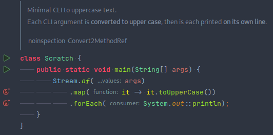

# Tabs vs spaces: the case of accessibility

Since forever, programmers have debated between the use of tabulations or spaces to represent indentation.
Nowadays, even mentioning this debate leads to dismissal—but recent tools make one option much better than the other. 

<!-- more -->

## How did it start?

Programmers constantly work with abstract trees: structures with parent-child relationships. Yet, code is almost always represented textually, which makes these relationships difficult to describe.

A very common solution to this problem is the use of indentation: whitespace is used to represent the encapsulation of a section of text within another. With a bit of habit, programmers can grasp the structure of a complex file at a glance, with no conscious effort.

Not all languages represent indentation with whitespace, though. For example, C-like languages use braces to separate subsections. Although not mandatory according to language rules, whitespace is still necessary for humans to understand the code:

```c
int main() {
    printf("Hello, World!\n");
    return 0;
}
```

Any experienced developer intuitively understands that the 2nd and 3rd lines are the body of the `main` function.
Because humans understand indentation faster than they read the code, it's really easy to create misleading examples by mismatching indentation and braces.

```c
if (foo == 0)
    printf("First line\n");
    printf("Second line\n");
```

In C, if an `if` is not followed by braces, only the next statement is included. The third line is an indentation mismatch: the user communicated that it is part of the `if` block, but it isn't.

**Indentation is crucial to developer's understanding of the code.**

But, there is a problem: there are many different ways to write whitespace. Since forever, developers have fought to decide on the best one, the main contenders being tabulation characters and regular space characters.

## How it's going?

The choice between tabulations and spaces is seen as mostly pointless by most of the community. The most common situation nowadays is that the project leader unilaterally decides on one option, which everyone follows.

Even then, not a single style has shown prevalent, and many different styles exist in the world. Here are a few examples:

- The Linux kernel uses [tabulations of size eight](https://www.kernel.org/doc/html/v4.10/process/coding-style.html#indentation),
- The Oracle Java code conventions use [four spaces](https://www.oracle.com/technetwork/java/codeconventions-150003.pdf) (page 5),
- The Google Java guide uses [two spaces](https://google.github.io/styleguide/javaguide.html#s4.2-block-indentation),
- The Kotlin code style uses [four spaces](https://kotlinlang.org/docs/coding-conventions.html#indentation),
- The Kotest library uses [three spaces](https://github.com/kotest/kotest/blob/master/CONTRIBUTING.md#coding-conventions).

If this choice is that unimportant that someone can arbitrarily make it, why did all these people choose different values? **The reason is that they chose the option that felt more readable _to them_.** This is the crux of the issue: there is no objectively better indentation size, everyone has different opinions on what they find more readable.

Sure, this is a minor issue. I doubt any developer has ever been unable to work on a codebase because the indentation style was different from what they are used to. At the very least, indentation size is much less important for readability than braces positioning.

But it is, still, important. Even a minor thing can disturb confort, and thus, understanding and efficiency.

## Code isn't text anymore

We are all used to our editors enhancing the text representation with utilities to make it more readable.
As the years go by, what we see on our screens is more and more removed from what is actually stored on disk.

Let's take two samples as an example. The first one is the raw text, as stored in the file. The second one is a screenshot of what it looks like in a modern IDE.

```text

/**
 * Minimal CLI to uppercase text.
 *
 * <p>Each CLI argument is <b>converted to upper case</b>,
 * then is each printed <b>on its own line</b>.
 *
 * @noinspection Convert2MethodRef
 */
class Scratch {
	public static void main(String[] args) {
		Stream.of(args)
			.map(it -> it.toUpperCase())
			.forEach(System.out::println);
	}
}
```



Let's go through some of the differences:

- Elements are colored differently based on their semantic meaning,
- The documentation header is rendered as an embedded document, including nested HTML tags,
- Whitespace characters are made visible (lines for tabulations, small dots for spaces),
- Function argument names are written to help understand what each argument is for,
- Composed characters are replaced by ligatures (`->` becomes `→`),
- Large buttons are added in the margin to execute the code or to navigate to other relevant sections.

Yet, this is a conservative example. Lesser-known tools, like [JetBrains MPS](https://www.jetbrains.com/mps/), do away with text representation completely, instead storing the raw AST, which allows them to display code as tables or other visual structures.

We have all these tools for enhancing readability, but each project maintainer still needs to enforce their own preferred indentation size? What if we could do better? 

## A false dichotomy

Participants in the tabs and spaces debate, and people who find it useless, often concentrate on concerns which are indeed, in my opinion, irrelevant. Here are a few examples:
 
- **Tabs take less binary space than spaces.** Sure, but the difference it makes, over your entire project, is probably fewer bytes saved than the size of your logo.
- **One of them is more convenient in (insert your preferred editor).** Any modern editor should be configurable to use one or the other, even if you use the 'tab' key.
- **Some character encodings deal with tabulations weirdly.** Anyone with any decency uses a UTF variant, it's not an issue and has not been for the past decades.

All proponents seem to forget the primary feature of tabulations. **Tabulations have the semantic meaning of representing indentation.** Semantic meaning should be, in most cases, what we strive for. For example, web developers are encouraged to use `<emph>` instead of `<i>` and `<b>`, because it allows changing the style after the fact without impacting the sources.

All modern editors allow users to configure which indentation size they want to be represented by a tab character. Yes, this includes GitHub, GitLab and most online tools. So, the choice isn't between tabs and spaces. It's between:

- Use tabs. **Each person can choose their preferred size.**
- Use one space and force everyone to do the same.
- Use two spaces and force everyone to do the same.
- Use three spaces and force everyone to do the same.
- Use four spaces and force everyone to do the same.
- …
- Use eight spaces and force everyone to do the same.

The very fact that each maintainer chooses a different indent size should make it clear to us: each of us has a preferred size that they feel more confortable with. As a community, we should respect this preference, and let people make their own choice. It is pointless to force a less readable situation on everyone, when the solution has been right there the whole time.

**So, next time you are in this position, make the most accessible choice: choose tabs.**
